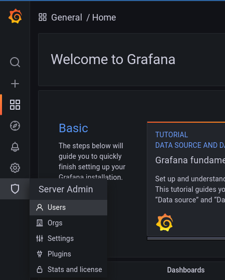

# Securing Grafana with Pomerium

[Grafana](https://grafana.com/) is an open-source analytics visualization and monitoring tool. It provides many user-contributed [Dashboards](https://grafana.com/grafana/dashboards/) that make it popular for enthusiasts as well as professionals.

This guide will demonstrate how to secure an instance of Grafana behind Pomerium, and provide users with a seamless login to Grafana using your Identity Provider (**IdP**).

## Before You Begin

This guide begins with the following steps assumed complete:

- A running instance of Pomerium. If you haven't already installed Pomerium, see our articles for installation on [Docker](/docs/install/readme.md), [Kubernetes](/docs/k8s/helm.md), or as an all-in-one [binary](/docs/install/binary.md).
- Administrator access to a working Grafana instance, including write access to the config file `grafana.ini`, usually found in `/etc/grafana`.

This guide uses the following temporary values in commands and configuration examples, which will need to be adjusted for your setup:

- `http://grafana:3000` - The path Pomerium will use to access Grafana. This example emulates a common Docker-based setup.
- `http://grafana.local:3000` - The path to access the Grafana interface from your local computer. We will need direct access to add at least one user before Pomerium is configured.
- `https://grafana.localhost.pomerium.io` - The path to access Grafana through Pomerium. Change this to match the domain space Pomerium is configured in.

## Enable JWT Authentication in Grafana

Edit `grafana.ini` to configure [JWT authentication]. Replace `auth.localhost.pomerium.io` with the value of [`authenticate_service_url`] in your Pomerium configuration:

```ini
[auth.jwt]
enabled = true
header_name = X-Pomerium-Jwt-Assertion
email_claim = email
jwk_set_url = https://auth.localhost.pomerium.io/.well-known/pomerium/jwks.json
cache_ttl = 60m
```

This configuration:

- enables authentication by JSON web token (**JWT**),
- defines the header to look at to provide the JWT,
- associates the email_claim in the JWT with the email of the Grafana user,
- specifies the location of the signing key for the JWT to validate it,
- sets a 60 minute cache time for the token.

Once you've saved and exited the file, restart Grafana.

## Add Users to Grafana

At this stage Grafana is configured to use the `email` claim in the JWT to associate an incoming connection with a user. Pomerium will be configured to include identity information via the JWT in the next section. But the user must still exist in Grafana to be associated. Otherwise, you will see this error in the browser after authenticating:

```json
{"message":"Invalid JWT"}
```

1. To add users without requiring them to accept an invitation, log in to Grafana directly as an admin user at `http://grafana.local:3000`.

1. Under the shield icon in the main menu (**Server Admin**), select **Users**.

    

    ::: warning
    This is distinct from the **Users** option under the cog wheel (**Configuration**), which will only finalize a new user when they accept an invite via email or link.
    :::

1. Click the **New user** button to create a new user. Make sure that the email address matches the one provided by Pomerium via your IdP.

    ::: tip
    You can access the special endpoint `/.pomerium` from any Pomerium route to view the data provided by Pomerium in the JWT.
    :::

After creating a new user in Grafana, that user should be logged in automatically when they access Grafana from the Pomerium route (after first authenticating with your IdP, of course).

## Configure the Pomerium Route

Add a route for Grafana to your Pomerium config. Change the following variables in the example below to match your setup:

| Variable | Description |
|:----- | ---- |
| `localhost.pomerium.io` | The domain space where Pomerium is configured to set up routes. You can also change `grafana` to a custom subdomain. |
| `http://grafana:3000` | The hostname or IP address and port from which Grafana is accessible within your local network or container environment. |
| `example.com` | Your company domain. The example policy allows access to Grafana for anyone with an email address from your company domain. Adjust the policy to match your organization's needs. |

::::: tabs
:::: tab config.yaml
For all-in-one or split service configurations using `config.yaml`, add the route to your `config.yaml` file:
```yaml
routes:
  - from: https://grafana.localhost.pomerium.io
    to: http://grafana:3000
    pass_identity_headers: true
    policy:
      - allow:
          or:
            - domain:
                is: example.com

```

::: tip Note
Docker-based installations may need to be restarted to pick up the new route.
:::

::::
:::: tab Ingress
If you're using the Pomerium Ingress Controller in Kubernetes, add an Ingress for the new route. Adjust the following example to match your configuration. Note that this example assumes a [cert-manager][ingress-cert-manager] solution for route certificates:

```yaml
apiVersion: networking.k8s.io/v1
kind: Ingress
metadata:
  name: grafana
  annotations:
    cert-manager.io/issuer: pomerium-issuer
    ingress.pomerium.io/policy: '[{"allow":{"and":[{"domain":{"is":"example.com"}}]}}]'
    #ingress.pomerium.io/secure_upstream: true # Uncomment if Grafana is serving content over HTTPS
    ingress.pomerium.io/pass_identity_headers: "true"
spec:
  ingressClassName: pomerium
  rules:
  - host: grafana.localhost.pomerium.io
    http:
      paths:
      - path: /
        pathType: Prefix
        backend:
          service:
            name: grafana
            port:
              number: 3000
  tls:
  - hosts:
    - grafana.localhost.pomerium.io
    secretName: grafana.localhost.pomerium.io-tls
```
::::
:::::

Once the new route is applied, users can access Grafana from `https://grafana.localhost.pomerium.io`

### Manage Access at Scale

The steps outlined above work to confirm the configuration for small teams, but adding users individually and manually does not scale for larger organizations. To add users to Grafana at scale, you can use a slightly different Grafana configuration to auto-signup users as they log in.

```ini
[auth.jwt]
enabled = true
header_name = X-Pomerium-Jwt-Assertion
email_claim = email
jwk_set_url = https://auth.localhost.pomerium.io/.well-known/pomerium/jwks.json
cache_ttl = 60m
username_claim = sub
auto_sign_up = true
[users]
auto_assign_org = true
auto_assign_org_role = Editor
```

This configuration:

- sets the username to the value of the "sub" claim,
- sets the login to automatically create a new user
- auto assigns the user to the existing default organization
- auto assigns the user the "Editor" role - note this could also be "Admin" or "Viewer"

This will autocreate a user with their email and username populated.  To have the "Name" field populated for users, you can set the JWT Claims Headers to `email,name` in this way:

```yaml
config:
  jwt_claims_headers: email,name

extraEnv:
  JWT_CLAIMS_HEADERS: email,name
```

This configuration will allow seamless authentication and authorization without any additional toil for your team.

::: tip Note
Ensure your Grafana is up to date to take advantage of auto_sign_up, as it is only available for JWT as of version 8.4.0 of Grafana.
:::

## Troubleshooting

### Local Signing Key

In instances where Grafana cannot get the signing key for the JWTs from the Pomerium authenticate service, you can place a copy of the key locally.

For example, wildcard certificates signed by LetsEncrypt may still be cross-signed by the [expired DST R3 root]. While many browsers still trust these certificates (as long as they are also signed by a valid root), some applications reject them, including Grafana:

```log
logger=context error=Get "https://authenticate.localhost.pomerium.io/.well-known/pomerium/jwks.json": x509: certificate signed by unknown authority
```

To circumvent this issue, you can use `curl` or `wget` to download the signing key locally:

::::: tabs
:::: tab curl

From the Grafana host:

```bash
curl https://authenticate.localhost.pomerium.io/.well-known/pomerium/jwks.json > /etc/grafana/jwks.json
```
::::
:::: tab wget
From the Grafana host:
```bash
wget -O /etc/grafana/jwks.json https://authenticate.localhost.pomerium.io/.well-known/pomerium/jwks.json
```
::::
:::::

Edit `grafana.ini` and add the `jwk_set_file` key to provide it to Grafana:

```ini
[auth.jwt]
enabled = true
header_name = X-Pomerium-Jwt-Assertion
email_claim = email
jwk_set_file = /etc/grafana/jwks.json
cache_ttl = 60m
```


[`authenticate_service_url`]: /reference/readme.md#authenticate-service-url
[expired DST R3 root]: https://letsencrypt.org/docs/dst-root-ca-x3-expiration-september-2021/
[Global Users]: https://grafana.com/docs/grafana/latest/http_api/admin/#global-users
[ingress-cert-manager]: /docs/k8s/ingress.md#cert-manager-integration
[JWT authentication]: https://grafana.com/docs/grafana/latest/auth/jwt/
