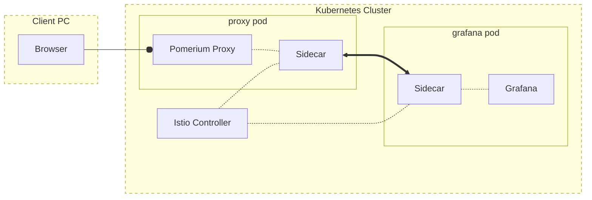

# Istio with Pomerium

Istio provides application-aware networking via a service mesh and control plane. When configured with the [Pomerium Ingress Controller] for kubernetes, this enables authorization (**[authZ]**) and authentication (**[authN]**) of [east-west traffic] in your internal network bringing you closer to complete [zero trust].

In this guide, we'll demonstrate how to configure Pomerium and Istio in a Kubernetes environment to provide mutual authentication at both the transport and application layer. We'll demonstrate first with a simple test service (Nginx), and then use [Grafana][grafana-guide] to illustrate how the final service can use the same authentication data for user association.

## Before You Begin

- You will need a Kubernetes environment with Istio installed. Refer to their [Getting Started](https://istio.io/latest/docs/setup/getting-started/) guide for more information.
- This configuration uses the Pomerium Ingress Controller for [north-south traffic]. This guide uses our [Helm chart](https://github.com/pomerium/pomerium-helm/tree/main/charts/pomerium) as detailed in [Install Pomerium using Helm]. We'll cover the values needed to configure the controller with an Istio service mesh, but you can refer to the [documentation][Pomerium Ingress Controller] for a complete overview of the controller spec.

## How it Works

In our [Mutual Authentication section on Sidecars](/docs/topics/mutual-auth.md#mutual-authentication-with-a-sidecar), we detail how a single service can offload authN and authz to a sidecar service. In a service mesh, each service in an internal network is deployed with a sidecar, and the controller configures them to provide mutual authentication with each other:



::: tip
This is a simplified model that doesn't describe the additional traffic for authorization and authentication.

See the [Legend](/docs/topics/mutual-auth.md#legend) on our Mutual Authentication page for details on our graphing style.
:::

## Configure Pomerium for Istio

Follow [Install Pomerium using Helm] to set up the Pomerium Ingress Controller and Services, with the following adjustments.

1. Apply the appropriate label for Istio injection into your Pomerium namespace:

    ```bash
    kubectl label namespace pomerium istio-injection=enabled
    ```

1. Update your `pomerium-values.yaml` file, making note of the changes for integration with Istio:

    ```yaml
    authenticate:
      idp:
        provider: "google"
        clientID: YOUR_CLIENT_ID
        clientSecret: YOUR_SECRET
        serviceAccount: YOUR_SERVICE_ACCOUNT

    proxy:
      deployment:
        podAnnotations:
          traffic.sidecar.istio.io/excludeInboundPorts: "80,443" # allow external connections to terminate directly on the Pomerium proxy rather than the sidecar

    config:
      rootDomain: localhost.pomerium.io
      generateTLS: false # disable certificate generation since we offload TLS to the mesh
      insecure: true # disable TLS on internal Pomerium services

    ingress:
      enabled: false # disable the default ingress resource since we are using our ingress controller

    ingressController:
      enabled: true # enable the Pomerium Ingress Controller

    redis:
      tls:
        enabled: false # TLS is handled by istio
      enabled: true

    service:
      authorize:
        headless: false # send traffic to the Pomerium Authorize through the Istio service rather than to individual pods
      databroker:
        headless: false # send traffic to the Pomerium Databroker through the Istio service rather than to individual pods
    ```

1. When [defining a test service](/docs/k8s/helm.md#define-a-test-service), you should now see two containers for the service pod:

    ```bash
    kubectl get pods
    NAME                                           READY   STATUS    RESTARTS   AGE
    ...
    nginx-6955473668-cxprp                         2/2     Running   0          19s
    ```

    This indicates that Istio has configured a sidecar container to handle traffic to and from the service.

## Istio CRDs

Now that Pomerium is installed in the cluster, we can define authentication and authorization rules for Istio, which will validate traffic to our example service as coming from the Pomerium Proxy service, through an authorized route, and with an authenticated user token.

1. Adjust the following example `nginx-istio-policy.yaml` file to match your Kubernetes environment and domain names:

    ```yaml
    apiVersion: security.istio.io/v1beta1
    kind: RequestAuthentication
    metadata:
      name: nginx-require-pomerium-jwt
    spec:
      selector:
        matchLabels:
          app.kubernetes.io/name: nginx # This matches the label applied to our test service
      jwtRules:
      - issuer: "authenticate.localhost.pomerium.io" # Adjust to match your Authenticate service URL
        audiences:
          - hello.localhost.pomerium.io # This should match the value of spec.host in the services Ingress
        fromHeaders:
          - name: "X-Pomerium-Jwt-Assertion"
        jwksUri: https://authenticate.localhost.pomerium.io/.well-known/pomerium/jwks.json # Adjust to match your Authenticate service URL.
        # The jwksUri key above is the preferred method of retrieving the signing key, and should be used in production. See
        # See https://istio.io/latest/docs/reference/config/security/jwt/#JWTRule
        #
        #If the Authenticate service is using a localhost or other domain that's not a FQDN. You can instead provide the content from that path using the jwks key:
        #jwks: |
        #  {"keys":[{"use":"sig","kty":"EC","kid":"e1c5d20b9cf771de0bd6038ee5b5fe831f771d3715b72c2db921611ffca7242f","crv":"P-256","alg":"ES256","x":"j8I1I7eb0Imr2pvxRk13cK9ZjAA3VPrdUIHkAslX2e0","y":"jfWNKJkq3b5hrTz2JsrXCcvgJCPP7QSFgX1ZT9wapIQ"}]}
    ---
    apiVersion: security.istio.io/v1beta1
    kind: AuthorizationPolicy
    metadata:
      name: nginx-require-pomerium-jwt
    spec:
      selector:
        matchLabels:
          app.kubernetes.io/name: nginx # This matches the label applied to our test service
      action: ALLOW
      rules:
      - when:
        - key: request.auth.claims[aud]
          values: ["hello.localhost.pomerium.io"] # This should match the value of spec.host in the service's Ingress
    ```

    This file defines two Custom Resources. The first is a `RequestAuthentication`, and it specifies:
    - For objects with the `app.kubernetes.io/name` label matching `nginx`, Istio will check that:
      - the request includes the header `X-Pomerium-Jwt-Assertion`, which provides a JWT,
      - **and** that JWT is issued by the Pomerium Authenticate service,
      - **and** the JWT is signed by the signing key provided by the Authenticate service.

    If the JWT is found and validated, then the content within can be checked against the `AuthorizationPolicy` below. If the JWT is provided but not validated, it will not pass `RequestAuthentication`. If the JWT is not provided, the request will automatically fail any `AuthorizationPolicy`.


    The second resource is an `AuthorizationPolicy`, and it species:
    - For objects with the `app.kubernetes.io/name` label matching `nginx`, only allow requests:
      - **if** the request includes a JWT (already validated by `RequestAuthentication`) with the audience key `aud`,
      - **and** the value of the `aud` key matches our known route, `hello.localhost.pomerium.io`.

    In other words, `RequestAuthentication` confirms that the incoming traffic to the sidecar has a signed and valid JWT, which confirms that the user has been authenticated and is authorized to access this service. The `AuthorizationPolicy` confirms that the traffic originated from a valid Pomerium route. The latter is especially important in Pomerium Enterprise, where a manager of a separate [Namespace](/enterprise/concepts.md#namespaces) could create a second route to a service normally routed and managed in your namespace.

1. Apply the new resources with `kubectl`:

    ```bash
    kubectl apply -f authorization-policy.yaml
    ```

1. Now when you go to `hello.localhost.pomerium.io` in the browser, you should see `RBAC: access denied`. This confirms that the policy is in place and denying our request. To allow the traffic, add the `pass_identity_headers` annotation to `example-ingress.yaml`:

    ```yaml{7}
    apiVersion: networking.k8s.io/v1
    kind: Ingress
    metadata:
      name: hello
      annotations:
        kubernetes.io/ingress.class: pomerium
        cert-manager.io/issuer: pomerium-issuer
        ingress.pomerium.io/pass_identity_headers: "true"
        ingress.pomerium.io/policy: '[{"allow":{"and":[{"domain":{"is":"example.com"}}]}}]'
    ...
    ```

1. After applying the update with `kubectl apply -f example-ingress.yaml`, you should now be able to access the test service in the browser.

## Grafana

To demonstrate complete authorization validation through to the upstream service we'll use Grafana, as it's easy to configure to accept user authN from JWTs.

1. Add the Grafana repository to Helm:

    ```bash
    helm repo add grafana https://grafana.github.io/helm-charts
    ```

1. Create a `grafana-values.yaml` file and add the annotations for the Pomerium Ingress Controller:

    ```yaml
    ingress:
      enabled: true
      annotations:
        # Specify the certificate issuer for your namespace or cluster. For example:
        # cert-manager.io/issuer: pomerium-issuer
        kubernetes.io/ingress.class: pomerium
        ingress.pomerium.io/pass_identity_headers: "true"
        ingress.pomerium.io/policy: |
          - allow:
              or:
                - domain:
                    is: example.com
      hosts:
        - "grafana.localhost.pomerium.io"
      tls:
      - hosts:
        - grafana.localhost.pomerium.io
        secretName: grafana.localhost.pomerium.io-tls
    persistence:
      type: pvc
      enabled: false
      # storageClassName: default
      accessModes:
        - ReadWriteOnce
      size: 10Gi
      # annotations: {}
      finalizers:
        - kubernetes.io/pvc-protection
    ```

    ::: tip
    Persistence is required to retain user data. Review the [Grafana Helm chart configuration](https://github.com/grafana/helm-charts/tree/main/charts/grafana#configuration) options to set the values for your environment.
    :::

1. Install Grafana to the cluster:

    ```bash
    helm upgrade --install grafana grafana/grafana --values grafana-values.yaml
    ```

1. Follow the instructions in the terminal output to log in as the admin user. Follow the [Add Users to Grafana](/guides/grafana.md#add-users-to-grafana) section of our Grafana guide to add a user that can be identified by the Pomerium JWT.


1. To the same file, add the following values to the `grafana.ini` section.

    <<< @/examples/kubernetes/istio/grafana.ini.yml

    This tells Grafana to use the email address provided in the `X-Pomerium-Jwt-Assertion` JWT and associate it with the matching Grafana user. It also disabled Grafana's login form. See Grafana's [JWT authentication](https://grafana.com/docs/grafana/latest/auth/jwt/) documentation for more configuration options.

1. Upgrade Grafana with the new configuration options:

    ```bash
    helm upgrade --install grafana grafana/grafana --values grafana-values.yaml
    ```

1. Now when you visit the Grafana route, you should be signed in as the user matching your Pomerium claim. To finalize the installation, create a new `grafana-istio-policy.yaml` file. Adjust the matchers and host values for Grafana, and enable `forwardOriginalToken`:

    ```yaml{15}
    apiVersion: security.istio.io/v1beta1
    kind: RequestAuthentication
    metadata:
      name: grafana-require-pomerium-jwt
    spec:
      selector:
        matchLabels:
          app.kubernetes.io/name: grafana # This matches the label applied to our test service
      jwtRules:
      - issuer: "authenticate.localhost.pomerium.io" # Adjust to match your Authenticate service URL
        audiences:
          - grafana.localhost.pomerium.io # This should match the value of spec.host in the services Ingress
        fromHeaders:
          - name: "X-Pomerium-Jwt-Assertion"
        forwardOriginalToken: true
        jwksUri: https://authenticate.localhost.pomerium.io/.well-known/pomerium/jwks.json # Adjust to match your Authenticate service URL.
        # The jwksUri key above is the preferred method of retrieving the signing key, and should be used in production.
        # See https://istio.io/latest/docs/reference/config/security/jwt/#JWTRule
        #
        #If the Authenticate service is using a localhost or other domain that's not a FQDN. You can instead provide the content from that path using the jwks key:
        #jwks: |
        #  {"keys":[{"use":"sig","kty":"EC","kid":"e1c5d20b9cf771de0bd6038ee5b5fe831f771d3715b72c2db921611ffca7242f","crv":"P-256","alg":"ES256","x":"j8I1I7eb0Imr2pvxRk13cK9ZjAA3VPrdUIHkAslX2e0","y":"jfWNKJkq3b5hrTz2JsrXCcvgJCPP7QSFgX1ZT9wapIQ"}]}
    ---
    apiVersion: security.istio.io/v1beta1
    kind: AuthorizationPolicy
    metadata:
      name: grafana-require-pomerium-jwt
    spec:
      selector:
        matchLabels:
          app.kubernetes.io/name: grafana # This matches the label applied to our test service
      action: ALLOW
      rules:
      - when:
        - key: request.auth.claims[aud]
          values: ["grafana.localhost.pomerium.io"] # This should match the value of spec.host in the service's Ingress
    ```

    Apply the policies with `kubectl apply -f` to complete the configuration.

[authN]: /docs/glossary.md#authentication
[authZ]:/docs/glossary.md#authorization
[Istio]: https://istio.io/latest/
[istio]: https://github.com/istio/istio
[certmanager]: https://github.com/jetstack/cert-manager
[grafana]: https://github.com/grafana/grafana
[grafana-guide]: /guides/grafana.md
[east-west traffic]: /docs/glossary.md#east-west-traffic
[north-south traffic]: /docs/glossary.md#north-south-traffic
[Pomerium Ingress Controller]: /docs/k8s/ingress.md
[zero trust]: /docs/background.md#zero-trust
[Install Pomerium using Helm]: /docs/k8s/helm.md
