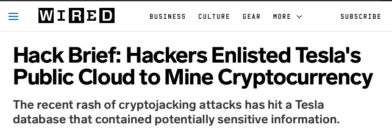

# Securing Kubernetes Dashboard

The following guide covers how to secure [Kubernetes Dashboard] using Pomerium. Kubernetes Dashboard is a powerful, web-based UI for managing Kubernetes clusters. Pomerium can act as a **forward-auth provider** _and_ as an independent **identity-aware access proxy** improving and adding single-sign-on to Kubernetes Dashboard's default access control. This guide aims to demonstrate a concrete example of those two methods of access control.


This tutorial covers:

- Deploying [Kubernetes Dashboard] using [Helm]
- Secure Kubernetes Dashboard access through Pomerium

## Before You Begin

This guide builds off of existing articles and guides. It assumes you have deployed Pomerium to your cluster using our Helm charts, configured a certificate solution like [cert-manager], and set up secure access to the Kubernetes API. Follow the instructions in these pages before you continue:

- [Install Pomerium using Helm]
- [Securing Kubernetes]

## Background

Though securing [kubernetes dashboard] as an example may seem contrived, the damages caused by an unsecured dashboard is a real threat vector. In late 2018, Telsa [determined](https://redlock.io/blog/cryptojacking-tesla) that the hackers who were running [crypto-mining malware](https://arstechnica.com/information-technology/2018/02/tesla-cloud-resources-are-hacked-to-run-cryptocurrency-mining-malware/) on their cloud accounts came in through an unsecured [Kubernetes Dashboard] instance.



## Install Kubernetes Dashboard

[Kubernetes Dashboard] is a general purpose, web-based UI for Kubernetes clusters. It allows users to manage applications running in the cluster and troubleshoot them, as well as manage the cluster itself.

1. Use [Helm] to install a new instance of [Kubernetes Dashboard].

  ```bash
  helm repo add kubernetes-dashboard https://kubernetes.github.io/dashboard/
  helm install kubernetes-dashboard kubernetes-dashboard/kubernetes-dashboard\
    --set ingress.enabled="false"
  ```

That's it. We've now configured kubernetes dashboard in our cluster. We've also explicitly told Helm that we are going to deploy our own custom access to the service through Pomerium, instead of a standard ingress.

## Add an Route

Following the configuration defined in [Install Pomerium using Helm], add a route for the Kubernetes Dashboard.

1. Modify `pomerium-values.yaml` with the following route:

    ```yaml
        - from: https://dashboard.localhost.pomerium.io
          to: https://kubernetes-dashboard.default.svc.cluster.local
          tls_skip_verify: true
          allow_spdy: true
          tls_skip_verify: true
          kubernetes_service_account_token_file: /var/run/secrets/kubernetes.io/serviceaccount/token
          policy:
            - allow:
                or:
                  - domain:
                      is: pomerium.com
    ```

    The service account token used for `kubernetes_service_account_token_file` is defined by our [helm chart]. Modify the policy to match your configuration.

1. Access to the dashbaord for a user is authorized by the cluster role binding defined in role-based access control (**RBAC**) permissions. Following the [User Permissions] section of [Securing Kubernetes], you should already have permissions for your user, or you can create a new RBAC definition following this example (`rbac-someuser.yaml`):

    ```yaml
    apiVersion: rbac.authorization.k8s.io/v1
    kind: ClusterRoleBinding
    metadata:
      name: cluster-admin-crb
    roleRef:
      apiGroup: rbac.authorization.k8s.io
      kind: ClusterRole
      name: cluster-admin
    subjects:
      - apiGroup: rbac.authorization.k8s.io
        kind: User
        name: someuser@example.com
    ```

    Apply the permissions with `kubectl apply -f rbac-someuser.yaml`

1. Apply the new route to Pomerium with Helm:

    ```bash
    helm upgrade --install pomerium pomerium/pomerium --values pomerium-values.yaml
    ```

## Conclusion

Because we've defined RBAC for our users, they can authenticate with Pomerium and Kubernetes will recognize that user in the Dashboard:

<video controls  muted="" playsinline="" width="100%" height="600" control=""><source src="./img/k8s-dashboard-user.mp4" type="video/mp4">
Your browser does not support the video tag.
</video>

🎉🍾🎊 **Congratulations** 🎉🍾🎊! You now have a single-sign-on enabled [Kubernetes Dashboard] protected by Pomerium.

[cert-manager]: https://cert-manager.io/docs/
[helm chart]: https://github.com/pomerium/pomerium-helm
[Helm]: https://helm.sh
[Install Pomerium using Helm]: /docs/k8s/helm.md
[kubernetes dashboard]: https://kubernetes.io/docs/tasks/access-application-cluster/web-ui-dashboard/
[Securing Kubernetes]: /guides/kubernetes.md
[User Permissions]: /guides/kubernetes.md#user-permissions
