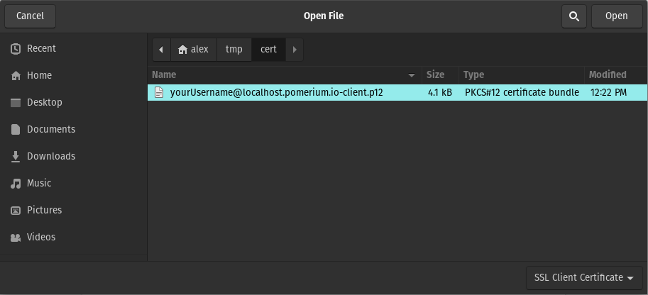
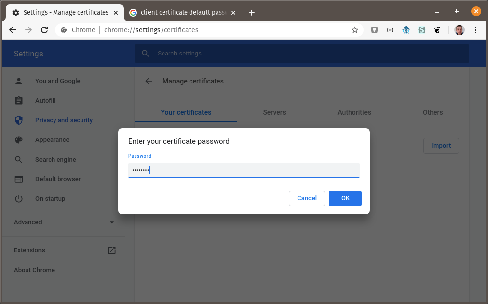
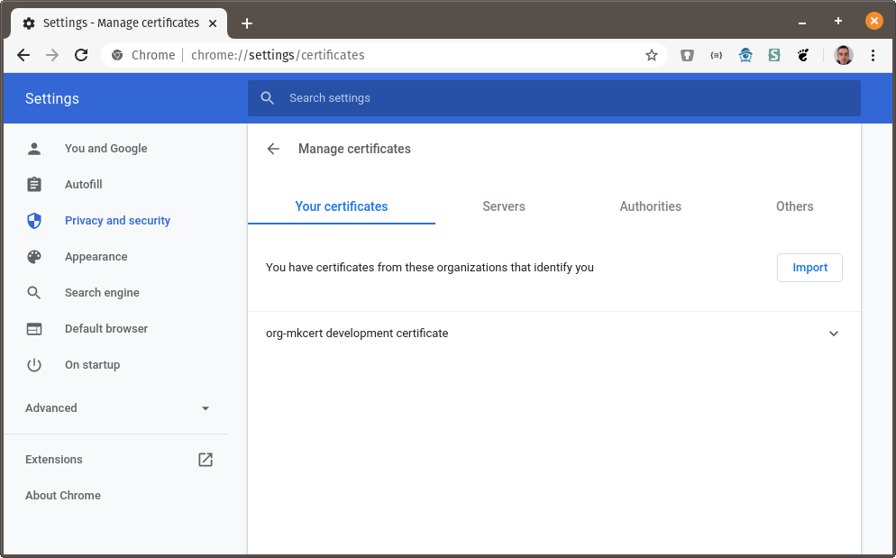
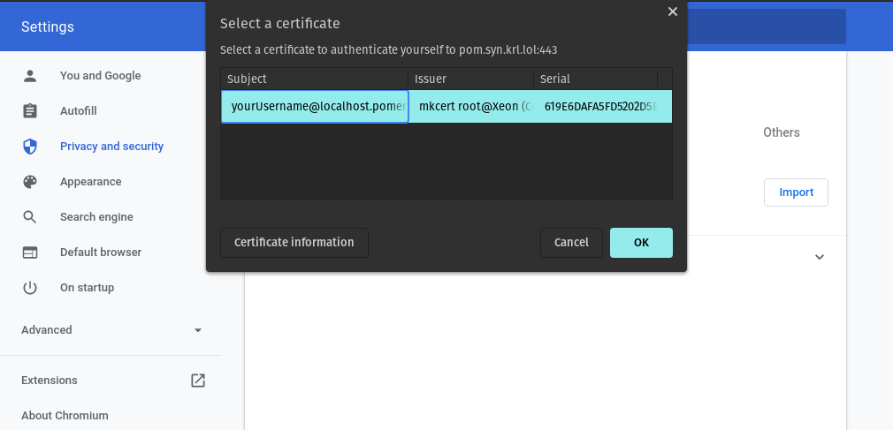

# Implementing mTLS With Pomerium

Secure communication on the web typically refers to using signed server certificates with the TLS protocol. TLS connections are both private and authenticated, preventing eavesdropping and impersonation of the server.

To authenticate clients (users), we typically use an identity provider (IDP). Clients must login before they can access a protected endpoint. However the TLS protocol also supports mutual authenticate (mTLS) via signed client certificates.

As of version 0.9.0, Pomerium supports requiring signed client certificates with the `client_ca`/`client_ca_file` configuration options. This guide covers how to configure Pomerium to implement mutual authentication using client certificates with a custom certificate authority.

## Creating Certificates

We will use the `mkcert` application to create the certificates. To install `mkcert` follow the instructions on [Github](https://github.com/FiloSottile/mkcert#installation).

For this guide the `localhost.pomerium.io` domain will be our root domain (all subdomains on `localhost.pomerium.io` point to `localhost`). First create a trusted root certificate authority:

```bash
mkcert -install
```

Next create a wildcard certificate for `*.localhost.pomerium.io`:

```bash
mkcert '*.localhost.pomerium.io'
```

This creates two files in the current working directory:

- `_wildcard.localhost.pomerium.io.pem`
- `_wildcard.localhost.pomerium.io-key.pem`

We will use these files for the server TLS certificate.

Finally create a client TLS certificate by running:

```bash
mkcert -client -pkcs12 '*.localhost.pomerium.io'
```

This creates a third file in the current working directory:

- `_wildcard.localhost.pomerium.io-client.p12`

## Configure Pomerium

Create a `config.yaml` file in the current directory. (You can replace `/YOUR/MKCERT/CAROOT` in this example with the value of `mkcert -CAROOT`)

```yaml
# config.yaml
address: ":8443"
authenticate_service_url: "https://authenticate.localhost.pomerium.io:8443"
certificate_file: "_wildcard.localhost.pomerium.io.pem"
certificate_key_file: "_wildcard.localhost.pomerium.io-key.pem"

# "$(mkcert -CAROOT)/rootCA.pem"
client_ca_file: "/YOUR/MKCERT/CAROOT/rootCA.pem"

# generate with "$(head -c32 /dev/urandom | base64)"
cookie_secret: "NvNqawPTQQelACkTovVcnfZQ3mP25Tv3DxeiUkRFyTA="
shared_secret: "NvNqawPTQQelACkTovVcnfZQ3mP25Tv3DxeiUkRFyTA="

# replace with your IDP provider
idp_provider: "google"
idp_client_id: YOUR_CLIENT_ID
idp_client_secret: YOUR_SECRET

policy:
  - from: "https://verify.localhost.pomerium.io:8443"
    to: "https://verify.org"
    allow_public_unauthenticated_access: true
```

Start Pomerium with:

```bash
pomerium -config config.yaml
```

Before visiting the page in your browser we have one final step.

## Install Client Certificate

Because `https://verify.localhost.pomerium.io:8443` now requires a client certificate to be accessed, we first need to install that client certificate in our browser. The following instructions are for Chrome, but client certificates are supported in all major browsers.

Go to <chrome://settings/certificates>:


Next click on Import and browse to the directory where you created the certificates above. Choose `_wildcard.localhost.pomerium.io-client.p12`:



You will be prompted for the certificate password. The default password is **`changeit`**:



You should see the `org-mkcert development certificate` in the list of your certificates:



## Using the Client Certificate

You can now visit **<https://verify.localhost.pomerium.io>** and you should be prompted to choose a client certificate:


