# Synology

Pomerium can be used to enable secure access to services on your Synology home server or network attached storage (NAS) device. Pomerium acting as an identity aware access proxy is particularly useful as many [self-hosted apps] lack or have insufficient built-in authentication mechanisms.

Using Pomerium on your Synology DSM device enables:

- Secure remote access to docker and synology web-applications without a VPN.
- Unified, multi-factor authentication with your identity provider of choice.
- Access to services by sub-domain (e.g. `plex.int.nas.example` or `wiki.int.nas.example`)
- TLS everywhere.

Pomerium is lightweight, can easily handle hundreds of concurrent requests, and a single instance typically uses <20MB of memory and very little CPU.

## Prerequisites

- A [docker-capable] synology product
- A [Google Cloud Account](https://console.cloud.google.com/)
- A configured [identity provider]
- [TLS certificates][certificate documentation]

Though any supported [identity provider] would work, this guide uses google.

## Port forwarding

This will vary depending on what type of router you have but the gist is you want to be forwarding all HTTPS/TLS traffic from port `443` to your NAS on some high port (in this case`8443`).

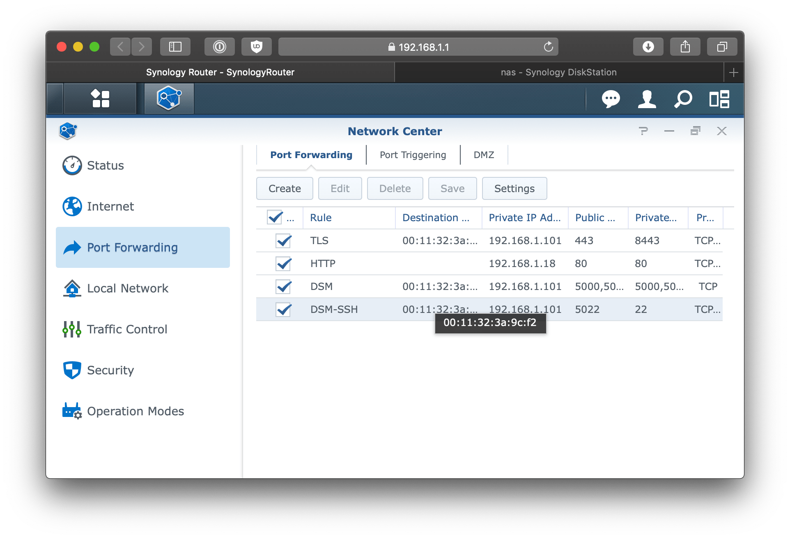

## DSM

[Diskstation manager] uses [nginx] under-the-hood to proxy incoming requests. In the following steps, we'll configure DSM to handle incoming requests and certificates.

### Configure DSM's Reverse Proxy

Go to **Control Panel** > **Application Portal** > **Reverse Proxy**.

Click **Create**.

Set the following **Reverse Proxy Rules**.

Field                | Description
-------------------- | -----------
Description          | pomerium
Source Protocol      | HTTPS
Source Hostname      | *
Destination Port     | 8443
HTTP/2               | Enabled
HSTS                 | Enabled
Destination Protocol | HTTP
Destination Hostname | localhost
Destination Port     | 32443

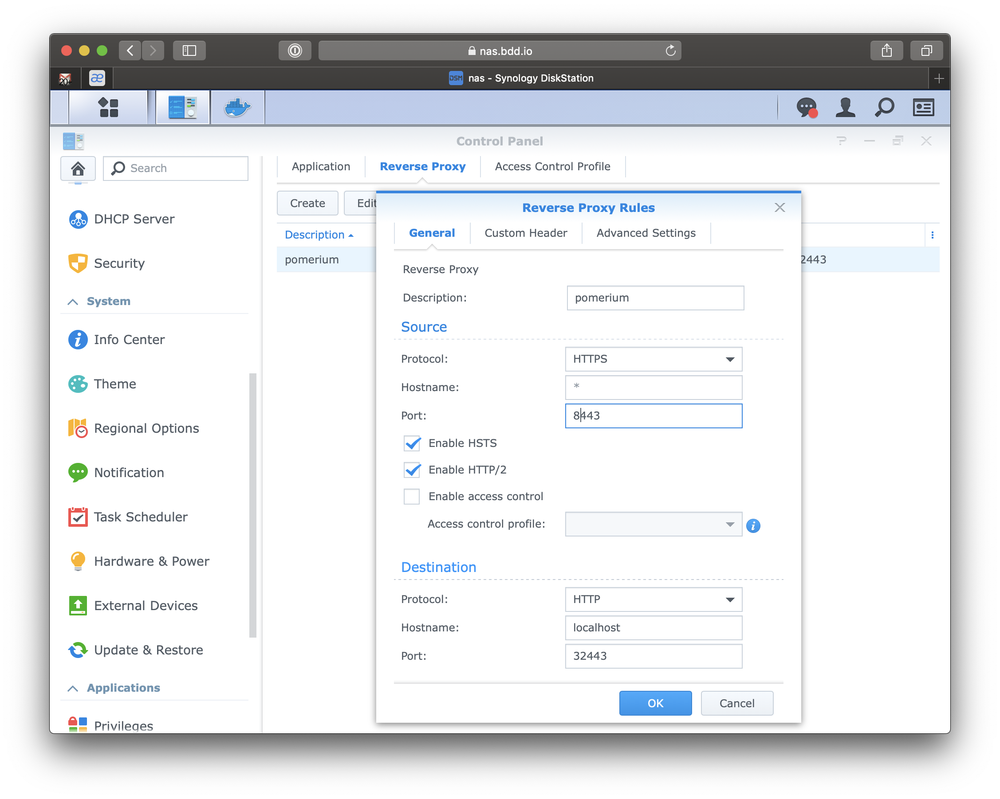

This will forward any incoming HTTPS traffic to the Pomerium service that is (not yet) running on port **32443**.

### Certificates

Though DSM does support getting [LetsEncrypt] certificates, they do not support wild-card subdomain certificates which require DNS validation. If you do not already have a wildcard certificate the [certificate documentation] or included [script] can help you generate one.

Go to **Control Panel** > **Security** > **Certificate**

Click **add a new certificate** > **Import certificate**.

Add the certificate chain for your wild-card subdomain certificates.

Once the certificate is showing on the list of certificates screen we need to tell DSM to use that certificate for all incoming traffic on port **8443**.

**Click configure**

Services | Certificate
-------- | -------------------
*:8443   | `*.int.nas.example`

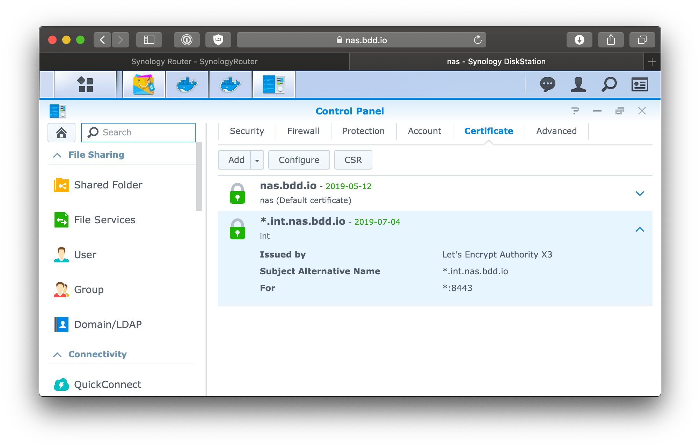

## Docker

### Download

Download and install docker from the package manager.

**Package manager** > **search** > **docker**

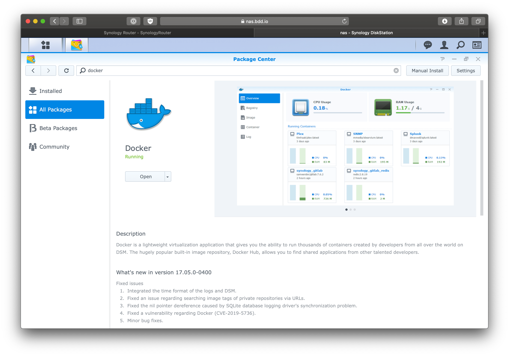

Once installed open the docker app.

**Docker** > **Registry** > **search** > **pomerium**

**Download** the official Pomerium docker image.

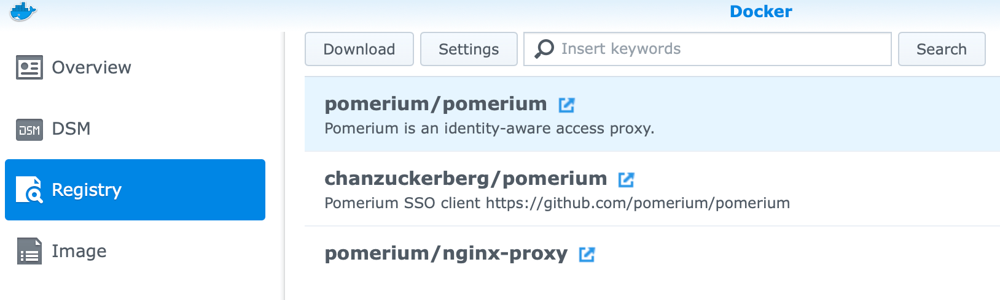

We'll also need a test application to manage access to. For this guide we'll use the canonical test app [httpbin] but the this could be any [self-hosted apps], wiki, download tool, etc.

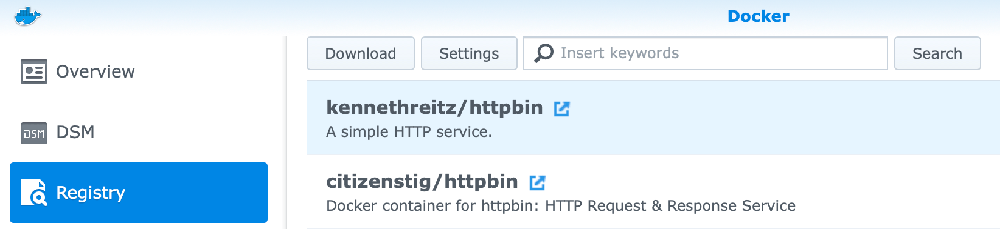

### Route

We will create an extremely basic route where `httpbin.int.nas.example` is replaced with the subdomain you want to use for the httpbin service, and `your.email.address@gmail.com` is replaced with your email address. All other users will be denied, and all other routes will be `404`.

```yaml
# route.yaml
- from: https://httpbin.int.nas.example
  to: http://httpbin
  policy:
    - allow:
        or:
          - email:
              is: your.email.address@gmail.com
```

### Configure

#### Httpbin

First, we'll setup our test app [httpbin].

Go to **Docker** > **Image**

Click **httpbin**

Set the **Container Name** to `httpbin`. Keep the rest of the settings the default.

Click **apply**

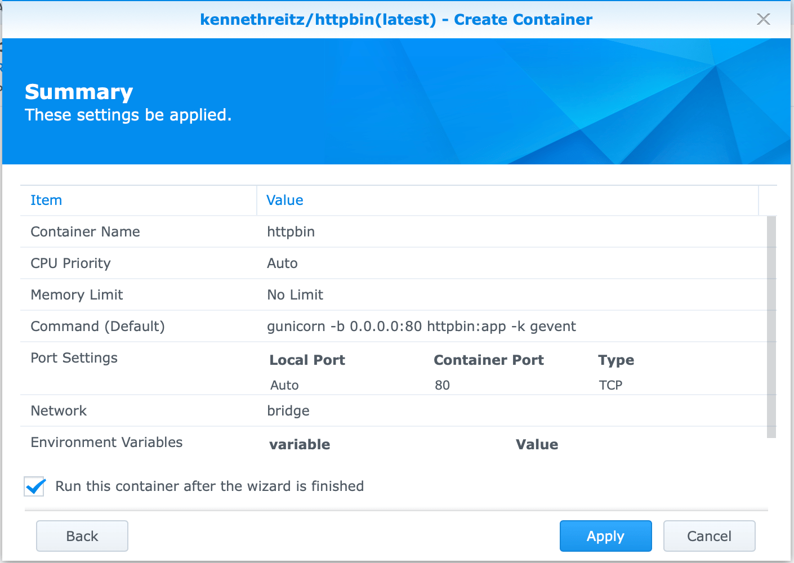

This will create a small python webserver on port 80\. The container name we just used will be used as an alias to route requests as defined in our policy.

#### Pomerium

Go to **Docker** > **Image**

Click **Pomerium**

Click **Launch**

Set the **Container Name** to `Pomerium`.

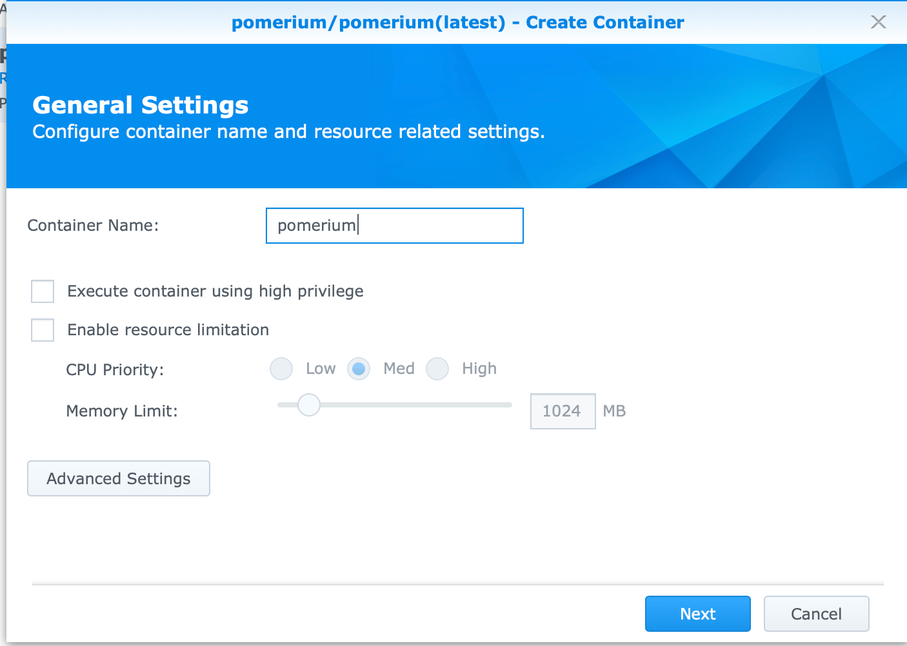

Click **Advanced Settings**

Go to **Port Settings** tab.

Add an entry where the **Local Port** is **32443** and the container port is **443** and the type is **TCP**.

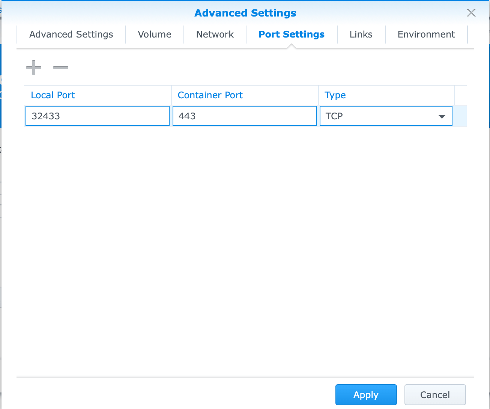

Go to **Links** tab.

Add an entry where the **Container Name** is `httpbin` and the **alias** is `httpbin`.

::: warning

The alias value must match the `to` DNS name from your policy.yaml configuration.

:::

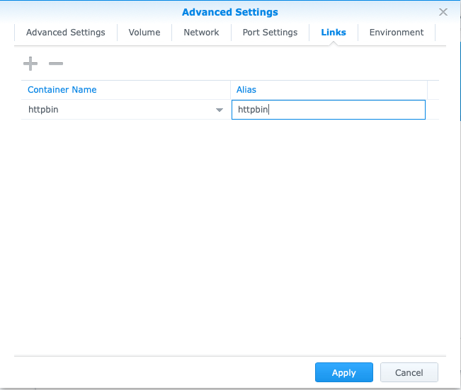

These are the minimum set of configuration settings to get Pomerium running in this deployment environment.

Go to **Environment** tab.

Field                    | Value
------------------------ | ---------------------------------------------------------------
POLICY                   | output of `base64 -i policy.yaml`
INSECURE_SERVER          | `TRUE`, internal routing within docker will not be encrypted.
IDP_CLIENT_SECRET        | Values from setting up your [identity provider]
IDP_CLIENT_ID            | Values from setting up your [identity provider]
IDP_PROVIDER             | Values from setting up your [identity provider] (e.g. `google`)
COOKIE_SECRET            | output of `head -c32 /dev/urandom                               | base64`
AUTHENTICATE_SERVICE_URL | `https://authenticate.int.nas.example`
SHARED_SECRET            | output of `head -c32 /dev/urandom                               | base64`

For a detailed explanation, and additional options, please refer to the [configuration variable docs]. Also note, though not covered in this guide, settings can be made via a mounted configuration file.

Click **Launch**.

If properly configured you should see something like the following when you see the container's details.

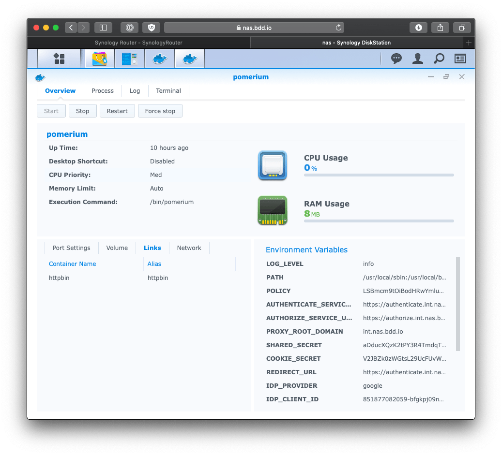

If something goes wrong, click the **Logs** tab.

## Try it out

Navigate to your new service. `https://httpbin.int.nas.example`

You should be redirected to your identity provider.

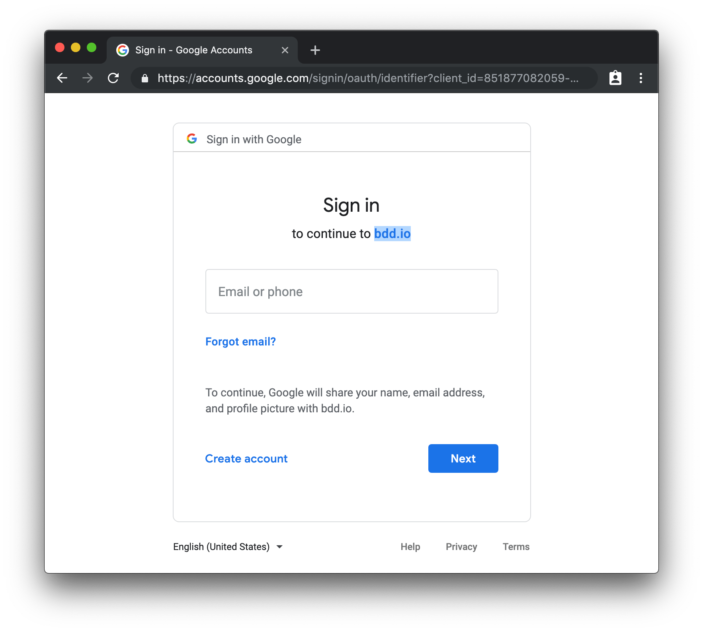

If you've enabled multi-factor authentication you should see that too.

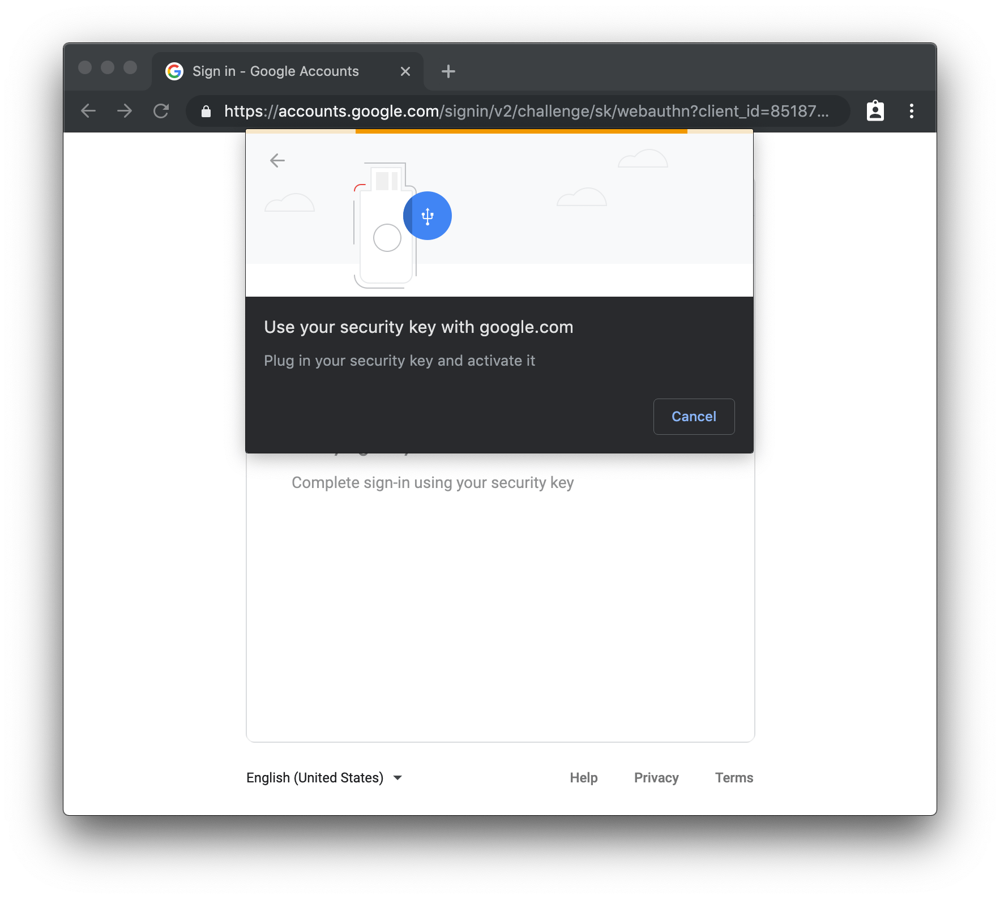

If that user is authorized to see the httpbin service, you should be redirected back to httpbin!

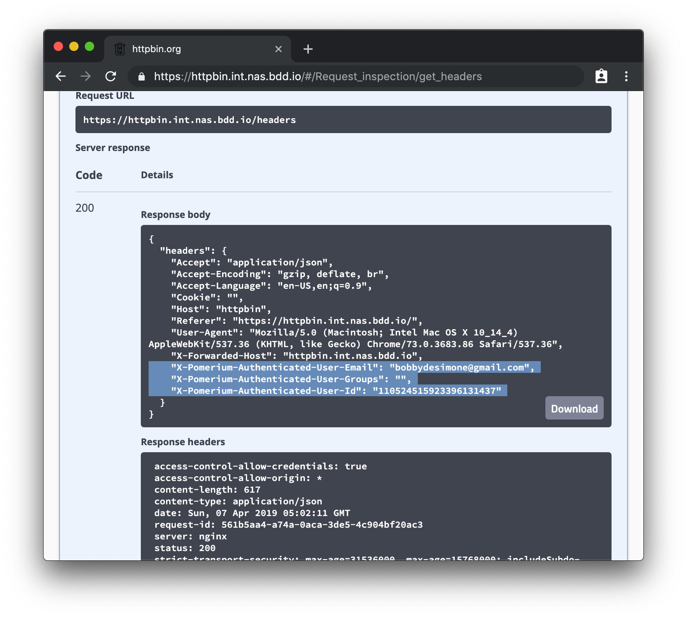

You can also navigate to the special pomerium endpoint `httpbin.your.domain.example/.pomerium/` to see your current user details.


And just to be safe, try logging in from another google account to see what happens. You should be greeted with a `403` unauthorized access page.

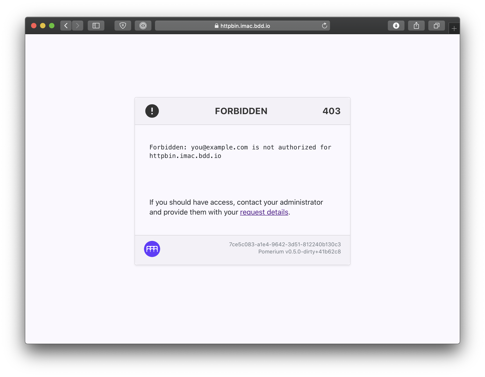

[certificate documentation]: /docs/topics/certificates.md
[configuration variable docs]: /reference/readme.md
[diskstation manager]: https://www.synology.com/en-us/dsm
[docker-capable]: https://www.synology.com/en-us/dsm/packages/Docker
[httpbin]: https://httpbin.org
[identity provider]: /docs/identity-providers/readme.md
[letsencrypt]: https://letsencrypt.org/
[nginx]: https://www.nginx.com
[self-hosted apps]: https://github.com/Kickball/awesome-selfhosted
