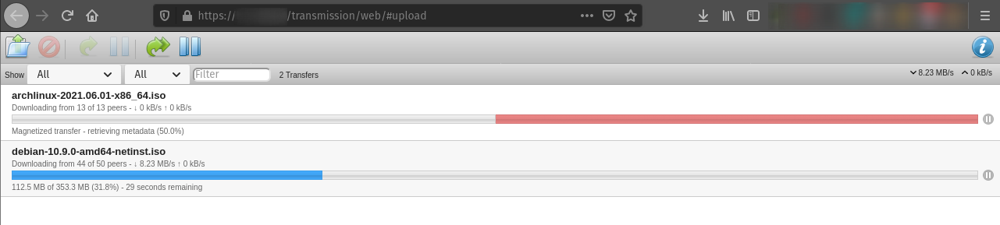

# Securing Transmission's RPC interface.

This guide demonstrates how Pomerium can secure a [Transmission] daemon. Pomerium is an identity-aware access proxy that can add single-sign-on / access control to any service.

## Transmission

[Transmission] is a powerful BitTorrent client that's highly customizable. It's often run remotely as a system daemon, and interacted with through a remote client using a [Remote Procedure Call](https://en.wikipedia.org/wiki/Remote_procedure_call) (**RPC**) interface.

The BitTorrent protocol is widely used in the distribution of large open-source softwares, like Linux distribution images and source code. Using Transmission as a system daemon, you can monitor and automatically download the latest versions to a local distribution server.

While there are software clients available to interact with the daemon over RPC, the easiest option is often to use the web interface built into the Transmission daemon package. Unfortunately, the service is only built to communicate over unencrypted HTTP, using basic [HTTP authentication](https://developer.mozilla.org/en-US/docs/Web/HTTP/Authentication). Using Pomerium, we can encrypt traffic from anywhere in the world to the local network hosting the Transmission service, and restrict access to authenticated users.

::: warning
Because RPC traffic to and from a Transmission daemon is unencrypted, we strongly suggest you only communicate from Pomerium to Transmission on a trusted private network. Note that some cloud hosting providers differentiate "private networking" (which is visible to all hosts in a data center) from "VLANS" which are only visible to your hosts. While you can configure a local proxy on your Transmission host to provide TLS encryption, that configuration is outside of the scope of this guide.

Running Pomerium and Transmission on the same host, using [docker](/docs/install/readme.md) for example,  negates this concern.
:::

## Before You Begin

This guide assumes you've completed one of the [quick start] guides, and have a running instance of Pomerium configured. This guide also assumes that Pomerium and Transmission will both run on separate hosts (physical or virtual machines) on the same private network (LAN or VLAN), but the configuration could be easily adjusted to fit your setup.

In addition to a working instance of Pomerium, have ready the [private IP addresses](https://en.wikipedia.org/wiki/Private_network#Private_IPv4_addresses) for the Pomerium and Transmission hosts. If you're running both on the same host, you can substitute `localhost` for both.

## Configuration

### Pomerium Config

Edit your `config.yaml` file to add the following policy. Note that `<>` denotes placeholder values that must be replaced if copying this config directly:

```yml
policy:
  - from: https://<transmission.mydomain.com> # Replace with the domain you want to use to access Transmission
    to: http://<private.ip.address>:9091 # Replace with the private network address of the Transmission host, or `localhost` if running on the same host.
    allowed_users:
      - myUser@mydomain.com # Replace with authorized user(s), or remove if using group permissions only.
    allowed_groups:
      - <transmission-users> # Replace with authorized user group(s), or remove if using user permissions only.
```
Remember to restart the Pomerium instance after saving your changes.

### Transmission Config

:::tip
Don't forget to switch your terminal prompt to the Transmission host before continuing.
:::

1. If you don't already have the Transmission daemon installed, install it through your distro's package manager. The commands to install and configure Transmission below assume a Debian-based Linux distribution, but can be adapted for any Linux distro:

    ```bash
    sudo apt update && sudo apt install transmission-daemon
    ```

1. Because Transmission writes over its configuration file when running, stop the service before continuing:

    ```bash
    sudo systemctl stop transmission-daemon.service
    ```

1. In your preferred text editor, open `/etc/transmission-daemon/settings.json` with `sudo` or as the root user. Look for the following key/value pairs, and edit appropriately.

    - Because we are using Pomerium to authenticate, disable HTTP auth:

      ```json
      "rpc-authentication-required": false,
      ```

    - Confirm that RPC is enabled:

      ```json
      "rpc-enabled": true,
      ```

    - Enable and configure the RPC Host whitelist. This ensures that the service will only work when accessed from the domain defined in Pomerium's `config.yaml` file (the `policy.from` key). This helps to mitigate DNS hijacking attack vectors:

      ```json
      "rpc-host-whitelist": "<transmission.mydomain.com>",
      "rpc-host-whitelist-enabled": true,
      ```

    - Enable and configure the RPC whitelist to only allow access from the Pomerium gateway. The value should be the private IP address of the Pomerium host, or `localhost` if running on the same host:

      ```json
      "rpc-whitelist": "<pomerium.host.address>",
      "rpc-whitelist-enabled": true,
      ```

1. After saving and closing `settings.json`, restart the service:

    ```bash
    sudo systemctl start transmission-daemon.service
    ```

You should now be able to authenticate and access your Transmission daemon remotely in the web browser, with TLS encryption!



In addition to the lock symbol in your browser's address bar, you can go to `<transmission.mydomain.com>/.pomerium` to view and confirm your session details.

[Transmission]: https://transmissionbt.com/
[quick start]: /docs/install/readme.md