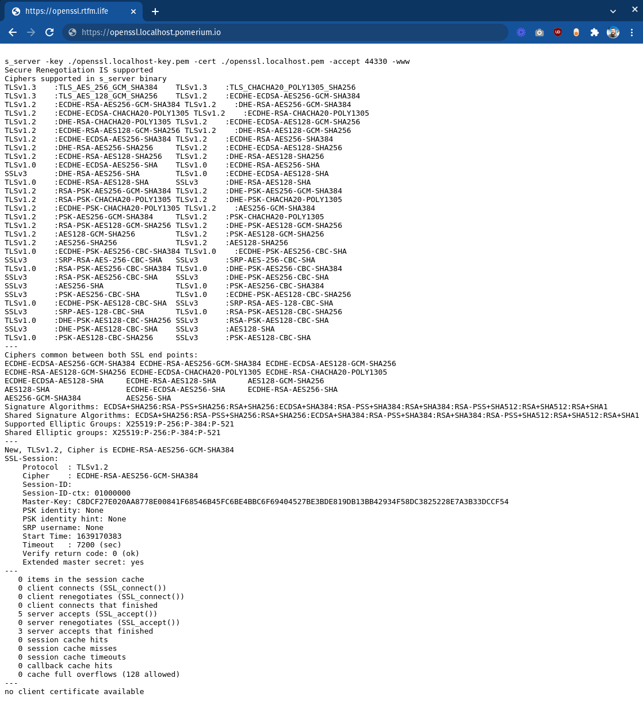

# Upstream mTLS With Pomerium

Part of a complete zero trust security model is secure communication between your identity-aware access proxy (Pomerium) and the upstream service it provides access to. This means both Pomerium *and* the upstream service will authenticate each other.

Pomerium confirms the identity of an upstream service by the TLS certificate it serves. See [`tls_custom_ca_file`] and [`tls_server_name`] for more information on configuring Pomerium to accept an upstream's TLS certificate.

Generally, every organization has a preferred method of managing internal certificates. How an upstream service is configured to validate and accept client certificates is entirely up to that specific service and how it's configured. To provide a general explanation, in this guide we will use [mkcert] to provide the client certificate to Pomerium, and [OpenSSL] as the upstream service.

## Before You Begin

- To simplify this proof-of-concept, we assume that Pomerium is running in [all-in-one mode](#before-you-begin) as a system service with the configuration file in the [standard location](/docs/install/binary.md#configuration-file), configured to communicate with an identity provider (**IdP**), and all command are run on the same host. You may have to move files and/or adjust paths and commands to match a different configuration.

    See [Install - Binaries](/docs/install/binary.md) for more information on initial setup.

- This guide uses [mkcert] to provide certificates. mkcert is a development tool, and not designed for production environments. In this guide, mkcert takes the place of your trusted certificate tooling solution.

- We use `*.pomerium.localhost.io` as the placeholder for the Pomerium domain space. We have set DNS records for this domain space to point to `127.0.0.1` (localhost), so you can use this domain space when testing Pomerium locally.
  If you're testing on your local computer with another domain space, you can edit `/etc/hosts` or use dnsmasq on [macOS](https://blog.thesparktree.com/local-development-with-wildcard-dns) or [Linux](https://sixfeetup.com/blog/local-development-with-wildcard-dns-on-linux) systems to route your domain space to your local computer.

## Create Certificates

!!!include(install-mkcert.md)!!!

1. Create a certificate and key for our example upstream service, OpenSSL:

    ```bash{1}
    mkcert openssl.localhost

    Created a new certificate valid for the following names 📜
    - "openssl.localhost"

    The certificate is at "./openssl.localhost.pem" and the key at "./openssl.localhost-key.pem" ✅

    It will expire on 10 March 2024 🗓
    ```

1. Create a client certificate and key for Pomerium to use:

    ```bash{1}
    mkcert -client 'pomerium@localhost'

    Created a new certificate valid for the following names 📜
    - "pomerium@localhost"

    The certificate is at "./pomerium@localhost-client.pem" and the key at "./pomerium@localhost-client-key.pem" ✅

    It will expire on 10 March 2024 🗓
    ```

1. Change ownership of the client certificate files and move them to Pomerium's configuration directory:

    ```bash
    sudo chown pomerium:pomerium pomerium@localhost-client*pem /etc/pomerium
    sudo mv pomerium@localhost-client*pem /etc/pomerium/
    ```

## Configure OpenSSL Server

OpenSSL is installed or easily available for most 'nix-based operating systems like macOS and Linux. In this demo it will take the place of an upstream service with mTLS support.

1. In a terminal environment and the same directory where you created the certificate files, start an OpenSSL server process. Note that it will run in the foreground until stopped, so you will need another terminal environment to run additional commands:

    ```bash
    openssl s_server -key ./openssl.localhost-key.pem -cert ./openssl.localhost.pem -accept 44330 -www
    ```

    You can confirm that the server is responding using `curl`:

    ```
    curl -k https://localhost:44330
    <HTML><BODY BGCOLOR="#ffffff">
    <pre>

    s_server -key ./openssl.localhost-key.pem -cert ./openssl.localhost.pem -accept 44330 -www
    Secure Renegotiation IS supported
    Ciphers supported in s_server binary
    ...
    ```

    ::: tip
    Even though OpenSSL is providing a certificate signed by a CA in our trust store, we need the `-k` flag because the domain name `localhost` doesn't match `openssl.localhost` defined in our certificate.
    :::

## Configure Pomerium

1. Update the `config.yaml` file in `/etc/pomerium` with a new route for this upstream service:

    ```yaml
    - from: https://openssl.localhost.pomerium.io
      to: https://localhost:44330
      tls_server_name: openssl.localhost
      policy:
        - allow:
            or:
              - email:
                  is: user@example.com
    ```

    Pomerium should automatically process changes when the configuration file is updated.

1. Visit <https://openssl.localhost.pomerium.io> in your browser to confirm the route:

    

    Note the last line:

    > no client certificate available

    In the next section, we'll adjust the OpenSSL server to require a client certificate and edit our Pomerium configuration to provide one.

## Install Pomerium Client Certificate

1. Stop the OpenSSL server process (**Ctrl+C**) and start a new one with the additional flag `-Verify 1`:

    ```bash
    openssl s_server -Verify 1 -key ./openssl.localhost-key.pem -cert ./openssl.localhost.pem -accept 44330 -www
    ```

1. When you refresh <https://openssl.localhost.pomium.io> in your browser, the connection will fail. Back in the terminal, the OpenSSL server should output errors containing:

    ```log
    SSL routines:tls_process_client_certificate:peer did not return a certificate
    ```

    This confirms that the upstream service is now requiring a trusted client certificate to allow connections.

1. Update the Pomerium route block to provide the client certificate:

    ```yaml
    - from: https://openssl.pomerium.localhost.io
      to: https://localhost:44330
      tls_server_name: openssl.localhost
      tls_client_cert_file: /etc/pomerium/pomerium@localhost-client.pem
      tls_client_key_file: /etc/pomerium/pomerium@localhost-client-key.pem
      policy:
        - allow:
            or:
              - email:
                  is: user@example.com

1. Now when you visit <https://openssl.localhost.pomium.io> you should see additional output under "Client certificate", confirming that the upstream service has read and validated Pomerium's client certificate. Your upstream service is now using mTLS for mutual authentication!

Obviously, the OpenSSL server is a trivial upstream service, and is purpose-built to work with encryption and not do much else. Practical mutual authenticate can be a much more complex setup depending on the service, and may require a sidecar or service mesh. This exercise merely serves to demonstrate how easy it is to configure Pomerium to provide client certificates to the upstream service.

## More Resources

 - [Mutual Authentication: A Component of Zero Trust](/docs/topics/mutual-auth.md)
 - [Client-Side mTLS With Pomerium](/guides/mtls.md)
 - [JWT Verification](/guides/jwt-verification.md)

[mkcert]: https://github.com/FiloSottile/mkcert
[OpenSSL]: https://www.openssl.org/
[`tls_custom_ca_file`]: /reference/readme.md#tls-custom-certificate-authority
[`tls_server_name`]: /reference/readme.md#tls-server-name