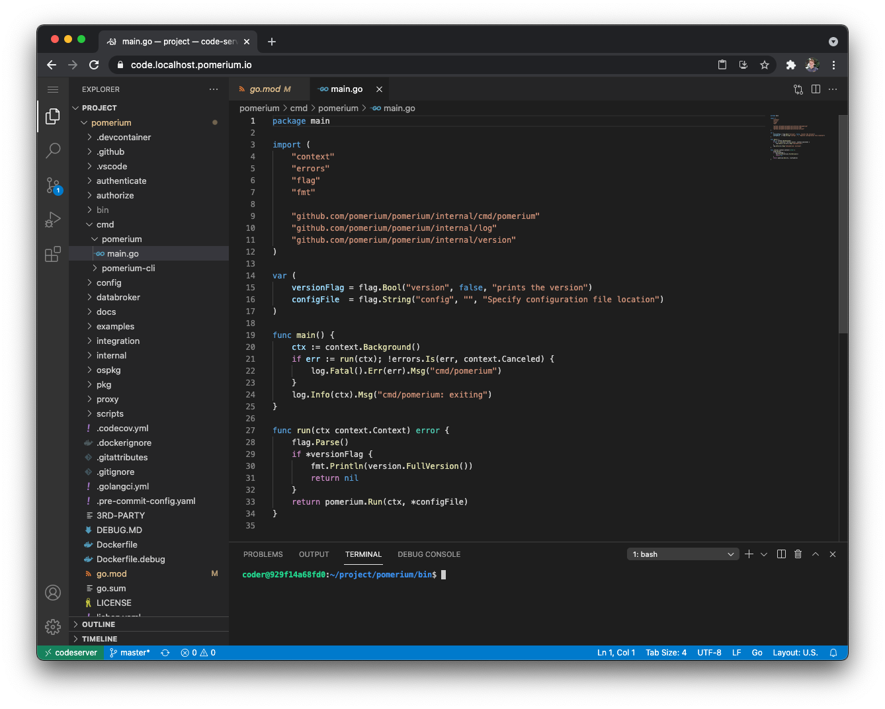
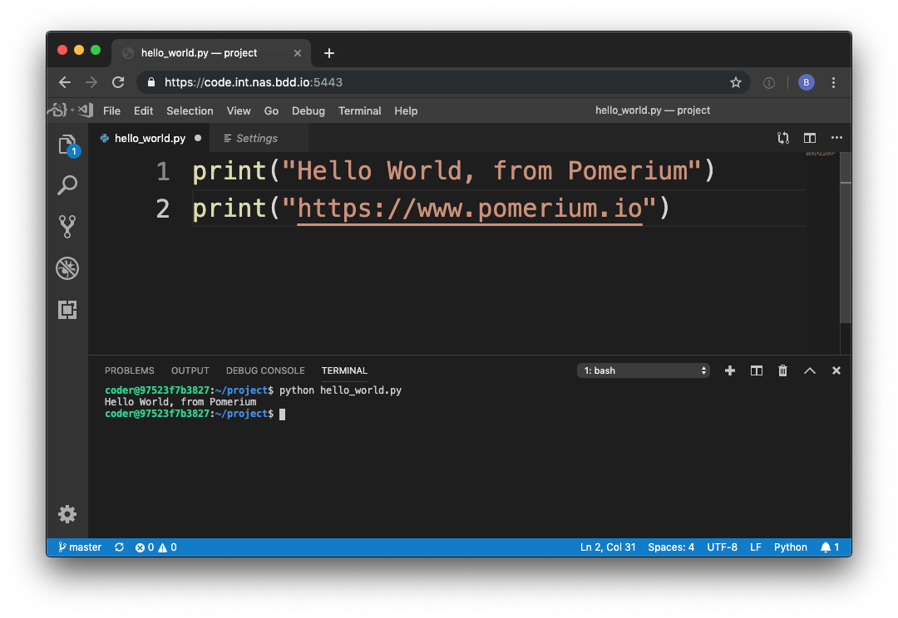

# Securing Visual Studio Code Server

## Background

This guide covers using Pomerium to secure an instance of [Visual Studio Code Server]. Pomerium is an identity-aware access proxy that can add single-sign-on / access control to any service, including visual studio code.

### Visual Studio Code

[Visual Studio Code] is an open source code editor by Microsoft that has become [incredibly popular](https://insights.stackoverflow.com/survey/2019#technology-_-most-popular-development-environments) in the last few years. For many developers, [Visual Studio Code] hits the sweet spot between no frills editors like vim/emacs and full feature IDE's like Eclipse and IntelliJ. VS Code offers some of the creature comforts like intellisense, git integration, and plugins, while staying relatively lightweight.

One of the interesting attributes of [Visual Studio Code] is that it is built on the [Electron](<https://en.wikipedia.org/wiki/Electron_(software_framework)>) framework which uses a headless instance of Chrome rendered as a desktop application. It didn't take long for folks to realize that if we already had this great IDE written in Javascript, it may be possible to make [Visual Studio Code] run remotely.

> "Any application that can be written in JavaScript, will eventually be written in JavaScript." — [Jeff Atwood](https://blog.codinghorror.com/the-principle-of-least-power/)

### VS Code Server

[Visual Studio Code Server] is an open-source project that allows you to run [Visual Studio Code] on a **remote** server, through the browser. For example, this is a screenshot taken at the end of this tutorial.



## Pre-requisites

This guide assumes you have already completed one of the [quick start] guides, and have a working instance of Pomerium up and running. For purpose of this guide, I'm going to use docker-compose, though any other deployment method would work equally well.

## Configure

### Pomerium Config

```
# config.yaml
# See detailed configuration settings : https://www.pomerium.io/docs/reference/reference/
authenticate_service_url: https://authenticate.corp.domain.example

# identity provider settings : https://www.pomerium.io/docs/identity-providers.html
idp_provider: google
idp_client_id: REPLACE_ME
idp_client_secret: REPLACE_ME

policy:
  - from: https://code.corp.domain.example
    to: http://codeserver:8443
    allowed_users:
      - some.user@domain.example
    allow_websockets: true
```

### Docker-compose

```yaml
codeserver:
  image: codercom/code-server:latest
  restart: always
  ports:
    - 8443:8443
  volumes:
    - ./code-server:/home/coder/project
  command: --allow-http --no-auth --disable-telemetry
```

Note we are mounting a directory called`./code-server`. Be sure to give the default docker user write permissions to that folder by running `chown -R 1000:1000 code-server/`.

### That's it!

Simply navigate to your domain (e.g. `https://code.corp.domain.example`).



### (Example) Develop Pomerium in Pomerium

As a final touch, now that we've done all this work we might as well use our new development environment to write some real, actual code. And what better project is there than Pomerium? 😉

To build Pomerium, we must [install go](https://golang.org/doc/install) which is as simple as running the following commands in the [integrated terminal].

```bash
wget https://dl.google.com/go/go1.12.7.linux-amd64.tar.gz
sudo tar -C /usr/local -xzf go1.12.7.linux-amd64.tar.gz
```

Then add Go to our [PATH].

```bash
# add the following to $HOME/.bashrc
export PATH=$PATH:/usr/local/go/bin
export PATH=$PATH:$(go env GOPATH)/bin
```

Reload [PATH] by opening the [integrated terminal] and sourcing the updated `.bashrc` file.

```bash
source $HOME/.bashrc
```

Finally, now that we've got Go all we need to go is grab the latest source and build.

```bash
# get the latest source
$ git clone https://github.com/pomerium/pomerium.git
# grab make
$ sudo apt-get install make
# build pomerium
$ make build
# run pomerium!
$ ./bin/pomerium --version
v0.2.0+e1c00b1
```

Happy remote hacking!!!😁

[visual studio code server]: https://github.com/cdr/code-server
[visual studio code]: https://code.visualstudio.com/
[synology nas]: ../docs/quick-start/synology.md
[quick start]: ../docs/quick-start
[integrated terminal]: https://code.visualstudio.com/docs/editor/integrated-terminal
[path]: https://en.wikipedia.org/wiki/PATH_(variable)
