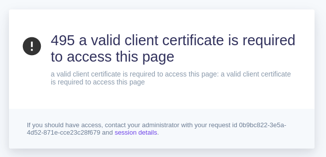

### Route doesn't ask for certificate

When Pomerium is configured to listen on alternate ports (as opposed to the standard `443` for TLS traffic), the route-specific mTLS keys `tls_downstream_client_ca` and `tls_downstream_client_ca_file` will not work. The route will not request the client certificate, resulting in an immediate HTTP 495 error:

This is a [known bug](https://github.com/pomerium/pomerium/issues/2794). Until it is resolved, mTLS must be set for all routes using `client_ca` or `client_ca_file` when using alternate ports.