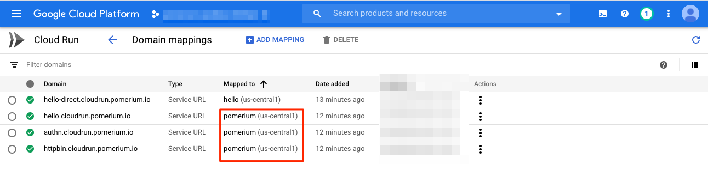
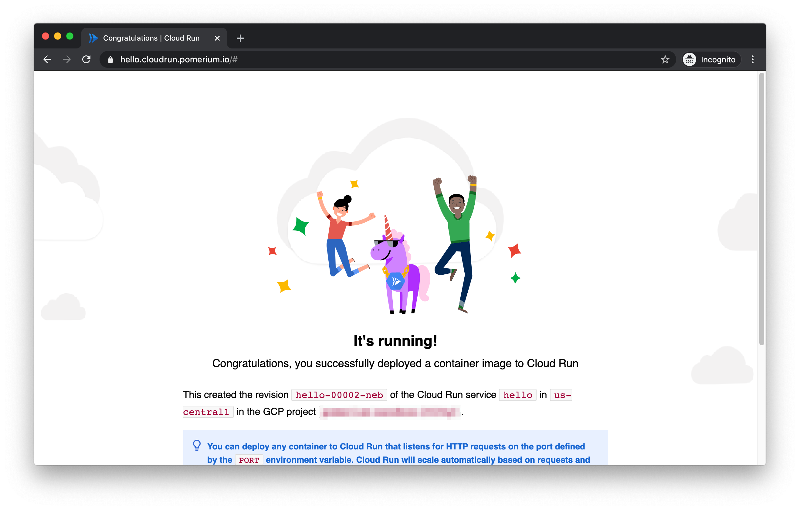
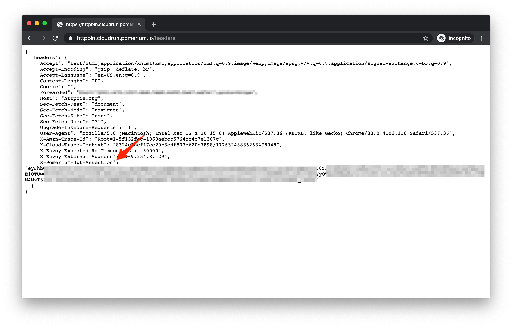

# Securing Cloud Run endpoints

This recipe's sources can be found [on github](https://github.com/pomerium/pomerium/tree/master/examples/cloudrun)

## Background

Services on [Cloud Run](https://cloud.google.com/run) and other Google Cloud serverless products can be restricted to only permit access with a properly signed [bearer token](https://cloud.google.com/run/docs/authenticating/service-to-service).  This allows requests from other services running in GCP or elsewhere to be securely authorized despite the endpoints being public.

These bearer tokens are not easily set in a browser session and must be refreshed on a regular basis, preventing them from being useful for end user authorization.  Pomerium, however, can generate compatible tokens on behalf of end users and proxy the request to these services.  

## How it works

- Add an IAM policy delegating `roles/run.invoker` permissions to a service account
- Run Pomerium with access to a key for the corresponding service account
- Publish DNS records for each protected application pointing to Pomerium
- Configure Pomerium with appropriate policy and `enable_google_cloud_serverless_authentication`

The protected application delegates trust to a GCP service account which Pomerium runs as, and Pomerium performs user based authorization on a per route basis.  This turns Pomerium into a bridge between a user-centric and service-centric authorization models.

## Pre-requisites

This guide assumes you have Editor access to a Google Cloud project which can be used for isolated testing, and a DNS zone which you are also able to control.  DNS does not need to be inside Google Cloud for the example to work.

## Set Up

To deploy Pomerium to Cloud Run securely and easily, a special image is maintained at `gcr.io/pomerium-io/pomerium-[version]-cloudrun`.  It allows sourcing configuration from GCP Secrets Manager, and sets some defaults for Cloud Run to keep configuration minimal.  We will be leveraging it in this example to store IdP credentials.


### Config
Set up a config.yaml to contain your IdP credentials and secrets (config.yaml):

<<< @/examples/cloudrun/config.yaml

Substitute `cloudrun.pomerium.io` for your own subdomain and your e-mail domain if
appropriate (policy.template.yaml):

<<< @/examples/cloudrun/policy.template.yaml

### DNS

Substitute `cloudrun.pomerium.io` for your own subdomain (zonefile.txt):

<<< @/examples/cloudrun/zonefile.txt

Or set an equivalent CNAME in your DNS provider.


## Deploy

Ensure you have set a default project:

```shell
glcoud config set default-project MYTESTPROJECT
```

<<< @/examples/cloudrun/deploy.sh

## Results

### Overview

We should see two applications deployed.  The `hello` app is our protected app, and pomerium is...Pomerium!


Notice that Pomerium allows unauthenticated access, but `hello` does not.

Here are the domain mappings set up:



### Direct Access

Let's verify we can't access the main application directly by visiting [https://hello-direct.cloudrun.pomerium.io](https://hello-direct.cloudrun.pomerium.io)


You should see a 403 error because you do not have the proper credentials.

### Authenticated Access

Now let's access via [https://hello.cloudrun.pomerium.io](https://hello.cloudrun.pomerium.io)

We should get an auth flow through your IdP:


And a hello page:



### Non-GCP Applications

If your target application is not running on GCP, you can also perform your own header validation.

Browse to [https://httpbin.cloudrun.pomerium.io](https://httpbin.cloudrun.pomerium.io/headers)

You should see your identity header set:



See [getting user's identity](/docs/reference/getting-users-identity.html) for more details on using this header.