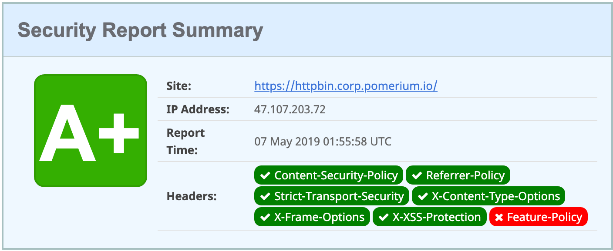

# Configuration

Pomerium can be configured using a configuration file ([YAML]/[JSON]/[TOML]) or [environmental variables]. In general, environmental variable keys are identical to config file keys but are in uppercase.

If you are coming from a kubernetes or docker background this should feel familiar. If not, check out the following primers.

- [Store config in the environment](https://12factor.net/config)
- [Kubernetes: Environment variables](https://kubernetes.io/docs/tasks/inject-data-application/define-environment-variable-container/)
- [Kubernetes: Config Maps](https://kubernetes.io/docs/tasks/configure-pod-container/configure-pod-configmap/)
- [Docker: Environment variables](https://docs.docker.com/compose/environment-variables/)

Using both [environmental variables] and config file keys is allowed and encouraged (for instance, secret keys are probably best set as environmental variables). However, if duplicate configuration keys are found, environment variables take precedence.

Pomerium will automatically reload the configuration file if it is changed. At this time, only policy is re-configured when this reload occurs, but additional options may be added in the future. It is suggested that your policy is stored in a configuration file so that you can take advantage of this feature.

## Global settings

These are configuration variables shared by all services, in all service modes.

### Service Mode

- Environmental Variable: `SERVICES`
- Config File Key: `services`
- Type: `string`
- Default: `all`
- Options: `all` `authenticate` `authorize` or `proxy`

Service mode sets the pomerium service(s) to run. If testing, you may want to set to `all` and run pomerium in "all-in-one mode." In production, you'll likely want to spin up several instances of each service mode for high availability.

### Address

- Environmental Variable: `ADDRESS`
- Config File Key: `address`
- Type: `string`
- Example: `:https`, `:443`, `:8443`
- Default: `:https`
- Required

Address specifies the host and port to serve HTTPS and gRPC requests from. If empty, `:https`/`:443` is used.

### Administrators

- Environmental Variable: `ADMINISTRATORS`
- Config File Key: `administrators`
- Type: slice of `string`
- Example: `"admin@example.com,admin2@example.com"`

Administrative users are [super user](https://en.wikipedia.org/wiki/Superuser) that can sign in as another user or group. User impersonation allows administrators to temporarily sign in as a different user.

### Shared Secret

- Environmental Variable: `SHARED_SECRET`
- Config File Key: `shared_secret`
- Type: [base64 encoded] `string`
- Required

Shared Secret is the base64 encoded 256-bit key used to mutually authenticate requests between services. It's critical that secret keys are random, and store safely. Use a key management system or `/dev/urandom/` to generate a key. For example:

```
head -c32 /dev/urandom | base64
```

### Debug

- Environmental Variable: `POMERIUM_DEBUG`
- Config File Key: `pomerium_debug`
- Type: `bool`
- Default: `false`

::: danger

Enabling the debug flag will result in sensitive information being logged!!!

:::

By default, JSON encoded logs are produced. Debug enables colored, human-readable logs to be streamed to [standard out](https://en.wikipedia.org/wiki/Standard_streams#Standard_output_(stdout)). In production, it's recommended to be set to `false`.

For example, if `true`

```
10:37AM INF cmd/pomerium version=v0.0.1-dirty+ede4124
10:37AM INF proxy: new route from=httpbin.corp.beyondperimeter.com to=https://httpbin.org
10:37AM INF proxy: new route from=ssl.corp.beyondperimeter.com to=http://neverssl.com
10:37AM INF proxy/authenticator: grpc connection OverrideCertificateName= addr=auth.corp.beyondperimeter.com:443
```

If `false`

```
{"level":"info","version":"v0.0.1-dirty+ede4124","time":"2019-02-18T10:41:03-08:00","message":"cmd/pomerium"}
{"level":"info","from":"httpbin.corp.beyondperimeter.com","to":"https://httpbin.org","time":"2019-02-18T10:41:03-08:00","message":"proxy: new route"}
{"level":"info","from":"ssl.corp.beyondperimeter.com","to":"http://neverssl.com","time":"2019-02-18T10:41:03-08:00","message":"proxy: new route"}
{"level":"info","OverrideCertificateName":"","addr":"auth.corp.beyondperimeter.com:443","time":"2019-02-18T10:41:03-08:00","message":"proxy/authenticator: grpc connection"}
```

### Log Level

- Environmental Variable: `LOG_LEVEL`
- Config File Key: `log_level`
- Type: `string`
- Options: `debug` `info` `warn` `error`
- Default: `debug`

Log level sets the global logging level for pomerium. Only logs of the desired level and above will be logged.

### Certificate

- Environmental Variable: either `CERTIFICATE` or `CERTIFICATE_FILE`
- Config File Key: `certificate` or `certificate_file`
- Type: [base64 encoded] `string` or relative file location
- Required

Certificate is the x509 _public-key_ used to establish secure HTTP and gRPC connections. If unset, pomerium will attempt to find and use `./cert.pem`.

### Certificate Key

- Environmental Variable: either `CERTIFICATE_KEY` or `CERTIFICATE_KEY_FILE`
- Config File Key: `certificate_key` or `certificate_key_file`
- Type: [base64 encoded] `string`
- Required

Certificate key is the x509 _private-key_ used to establish secure HTTP and gRPC connections. If unset, pomerium will attempt to find and use `./privkey.pem`.

### Global Timeouts

- Environmental Variables: `TIMEOUT_READ` `TIMEOUT_WRITE` `TIMEOUT_READ_HEADER` `TIMEOUT_IDLE`
- Config File Key: `timeout_read` `timeout_write` `timeout_read_header` `timeout_idle`
- Type: [Go Duration](https://golang.org/pkg/time/#Duration.String) `string`
- Example: `TIMEOUT_READ=30s`
- Defaults: `TIMEOUT_READ_HEADER=10s` `TIMEOUT_READ=30s` `TIMEOUT_WRITE=0` `TIMEOUT_IDLE=5m`

Timeouts set the global server timeouts. For route-specific timeouts, see [policy](./#policy).


> For a deep dive on timeout values see [these](https://blog.cloudflare.com/the-complete-guide-to-golang-net-http-timeouts/) [two](https://blog.cloudflare.com/exposing-go-on-the-internet/) excellent blog posts.

### HTTP Redirect Address

- Environmental Variable: `HTTP_REDIRECT_ADDR`
- Config File Key: `http_redirect_addr`
- Type: `string`
- Example: `:80`, `:http`, `:8080`
- Optional

If set, the HTTP Redirect Address specifies the host and port to redirect http to https traffic on. If unset, no redirect server is started.

### Metrics Address

- Environmental Variable: `METRICS_ADDRESS`
- Config File Key: `metrics_address`
- Type: `string`
- Example: `:8080`, `127.0.0.1:9090`, ``
- Default: `disabled`
- Optional

Expose a prometheus format HTTP endpoint on the specified port. Disabled by default.

**Use with caution:** the endpoint can expose frontend and backend server names or addresses. Do not expose the metrics port if this is sensitive information.

#### Metrics tracked

Name                            | Type      | Description
:------------------------------ | :-------- | :--------------------------------------------
grpc_client_request_duration_ms | Histogram | GRPC client request duration by service
grpc_client_request_size_bytes | Histogram | GRPC client request size by service
grpc_client_requests_total      | Counter   | Total GRPC client requests made by service
grpc_client_response_size_bytes | Histogram | GRPC client response size by service
grpc_server_request_duration_ms | Histogram | GRPC server request duration by service
grpc_server_request_size_bytes | Histogram | GRPC server request size by service
grpc_server_requests_total      | Counter   | Total GRPC server requests made by service
grpc_server_response_size_bytes | Histogram | GRPC server response size by service
http_client_request_duration_ms | Histogram | HTTP client request duration by service
http_client_request_size_bytes | Histogram | HTTP client request size by service
http_client_requests_total      | Counter   | Total HTTP client requests made by service
http_client_response_size_bytes | Histogram | HTTP client response size by service
http_server_request_duration_ms | Histogram | HTTP server request duration by service
http_server_request_size_bytes | Histogram | HTTP server request size by service
http_server_requests_total      | Counter   | Total HTTP server requests handled by service
http_server_response_size_bytes | Histogram | HTTP server response size by service
pomerium_config_checksum_int64 | Gauge | Currently loaded configuration checksum by service
pomerium_config_last_reload_success | Gauge | Whether the last configuration reload succeeded by service
pomerium_config_last_reload_success_timestamp | Guage | The timestamp of the last successful configuration reload by service
pomerium_build_info | Gauge | Pomerium build metadata by git revision, service, version and goversion

### Policy

- Environmental Variable: `POLICY`
- Config File Key: `policy`
- Type: [base64 encoded] `string` or inline policy structure in config file
- **Required** However, pomerium will safely start without a policy configured, but will be unable to authorize or proxy traffic until the configuration is updated to contain a policy.

Policy contains route specific settings, and access control details. If you are configuring via POLICY environment variable, just the contents of the policy needs to be passed. If you are configuring via file, the policy should be present under the policy key. For example,

<<< @/docs/docs/examples/config/policy.example.yaml

A list of policy configuration variables follows.

#### From

- `yaml`/`json` setting: `from`
- Type: `URL` (must contain a scheme and hostname)
- Required
- Example: `https://httpbin.corp.example.com`

`From` is externally accessible source of the proxied request.

#### To

- `yaml`/`json` setting: `to`
- Type: `URL` (must contain a scheme and hostname)
- Required
- Example: `http://httpbin` , `https://192.1.20.12:8080`, `http://neverssl.com`

`To` is the destination of a proxied request. It can be an internal resource, or an external resource.

#### Allowed Users

- `yaml`/`json` setting: `allowed_users`
- Type: collection of `strings`
- Required
- Example: `alice@pomerium.io` , `bob@contractor.co`

Allowed users is a collection of whitelisted users to authorize for a given route.

#### Allowed Groups

- `yaml`/`json` setting: `allowed_groups`
- Type: collection of `strings`
- Required
- Example: `admins` , `support@company.com`

Allowed groups is a collection of whitelisted groups to authorize for a given route.

#### Allowed Domains

- `yaml`/`json` setting: `allowed_domains`
- Type: collection of `strings`
- Required
- Example: `pomerium.io` , `gmail.com`

Allowed domains is a collection of whitelisted domains to authorize for a given route.

#### CORS Preflight

- `yaml`/`json` setting: `cors_allow_preflight`
- Type: `bool`
- Optional
- Default: `false`

Allow unauthenticated HTTP OPTIONS requests as [per the CORS spec](https://developer.mozilla.org/en-US/docs/Web/HTTP/CORS#Preflighted_requests).

#### Public Access

- `yaml`/`json` setting: `allow_public_unauthenticated_access`
- Type: `bool`
- Optional
- Default: `false`

**Use with caution:** Allow all requests for a given route, bypassing authentication and authorization. Suitable for publicly exposed web services.

If this setting is enabled, no whitelists (e.g. Allowed Users) should be provided in this route.

#### Route Timeout

- `yaml`/`json` setting: `timeout`
- Type: [Go Duration](https://golang.org/pkg/time/#Duration.String) `string`
- Optional
- Default: `30s`

Policy timeout establishes the per-route timeout value. Cannot exceed global timeout values.

#### Websocket Connections

- Config File Key: `allow_websockets`
- Type: `bool`
- Default: `false`

If set, enables proxying of websocket connections.

**Use with caution:** By definition, websockets are long-lived connections, so [global timeouts](#global-timeouts) are not enforced. Allowing websocket connections to the proxy could result in abuse via [DOS attacks](https://www.cloudflare.com/learning/ddos/ddos-attack-tools/slowloris/).

#### TLS Skip Verification

- Config File Key: `tls_skip_verify`
- Type: `bool`
- Default: `false`

TLS Skip Verification controls whether a client verifies the server's certificate chain and host name. If enabled, TLS accepts any certificate presented by the server and any host name in that certificate. In this mode, TLS is susceptible to man-in-the-middle attacks. This should be used only for testing.

#### TLS Custom Certificate Authority

- Config File Key: `tls_custom_ca`
- Type: [base64 encoded] `string`
- Optional

TLS Custom Certificate Authority defines the set of root certificate authorities that clients use when verifying server certificates.

Note: This setting will replace (not append) the system's trust store for a given route.

## Authenticate Service

### Authenticate Service URL

- Environmental Variable: `AUTHENTICATE_SERVICE_URL`
- Config File Key: `authenticate_service_url`
- Type: `URL`
- Required
- Example: `https://authenticate.corp.example.com`

Authenticate Service URL is the externally accessible URL for the authenticate service.

### Identity Provider Name

- Environmental Variable: `IDP_PROVIDER`
- Config File Key: `idp_provider`
- Type: `string`
- Required
- Options: `azure` `google` `okta` `gitlab` `onelogin` or `oidc`

Provider is the short-hand name of a built-in OpenID Connect (oidc) identity provider to be used for authentication. To use a generic provider,set to `oidc`.

See [identity provider] for details.

### Identity Provider Client ID

- Environmental Variable: `IDP_CLIENT_ID`
- Config File Key: `idp_client_id`
- Type: `string`
- Required

Client ID is the OAuth 2.0 Client Identifier retrieved from your identity provider. See your identity provider's documentation, and our [identity provider] docs for details.

### Identity Provider Client Secret

- Environmental Variable: `IDP_CLIENT_SECRET`
- Config File Key: `idp_client_secret`
- Type: `string`
- Required

Client Secret is the OAuth 2.0 Secret Identifier retrieved from your identity provider. See your identity provider's documentation, and our [identity provider] docs for details.

### Identity Provider URL

- Environmental Variable: `IDP_PROVIDER_URL`
- Config File Key: `idp_provider_url`
- Type: `string`
- Required, depending on provider

Provider URL is the base path to an identity provider's [OpenID connect discovery document](https://openid.net/specs/openid-connect-discovery-1_0.html). For example, google's URL would be `https://accounts.google.com` for [their discover document](https://accounts.google.com/.well-known/openid-configuration).

### Identity Provider Scopes

- Environmental Variable: `IDP_SCOPES`
- Config File Key: `idp_scopes`
- Type: `[]string` comma separated list of oauth scopes.
- Default: `oidc`,`profile`, `email`, `offline_access` (typically)
- Optional for built-in identity providers.

Identity provider scopes correspond to access privilege scopes as defined in Section 3.3 of OAuth 2.0 RFC6749\. The scopes associated with Access Tokens determine what resources will be available when they are used to access OAuth 2.0 protected endpoints. If you are using a built-in provider, you probably don't want to set customized scopes.

### Identity Provider Service Account

- Environmental Variable: `IDP_SERVICE_ACCOUNT`
- Config File Key: `idp_service_account`
- Type: `string`
- Required, depending on provider

Identity Provider Service Account is field used to configure any additional user account or access-token that may be required for querying additional user information during authentication. For a concrete example, Google an additional service account and to make a follow-up request to query a user's group membership. For more information, refer to the [identity provider] docs to see if your provider requires this setting.

## Proxy Service

### Signing Key

- Environmental Variable: `SIGNING_KEY`
- Config File Key: `signing_key`
- Type: [base64 encoded] `string`
- Optional

Signing key is the base64 encoded key used to sign outbound requests. For more information see the [signed headers](./signed-headers.md) docs.

### Authenticate Service URL

- Environmental Variable: `AUTHENTICATE_SERVICE_URL`
- Config File Key: `authenticate_service_url`
- Type: `URL`
- Required
- Example: `https://authenticate.corp.example.com`

Authenticate Service URL is the externally accessible URL for the authenticate service.

### Authenticate Internal Service URL

- Environmental Variable: `AUTHENTICATE_INTERNAL_URL`
- Config File Key: `authenticate_internal_url`
- Type: `URL`
- Optional
- Example: `https://pomerium-authenticate-service.pomerium.svc.cluster.local`

Authenticate Internal Service URL is the internally routed dns name of the authenticate service. This setting is typically used with load balancers that do not gRPC, thus allowing you to specify an internally accessible name.

### Authorize Service URL

- Environmental Variable: `AUTHORIZE_SERVICE_URL`
- Config File Key: `authorize_service_url`
- Type: `URL`
- Required
- Example: `https://access.corp.example.com` or `https://pomerium-authorize-service.pomerium.svc.cluster.local`

Authorize Service URL is the location of the internally accessible authorize service. NOTE: Unlike authenticate, authorize has no publicly accessible http handlers so this setting is purely for gRPC communication.

If your load balancer does not support gRPC pass-through you'll need to set this value to an internally routable location (`https://pomerium-authorize-service.pomerium.svc.cluster.local`) instead of an externally routable one (`https://access.corp.example.com`).

### Override Certificate Name

- Environmental Variable: `OVERRIDE_CERTIFICATE_NAME`
- Config File Key: `override_certificate_name`
- Type: `int`
- Optional (but typically required if Authenticate Internal Service Address is set)
- Example: `*.corp.example.com` if wild card or `authenticate.corp.example.com`/`authorize.corp.example.com`

When Authenticate Internal Service Address is set, secure service communication can fail because the external certificate name will not match the internally routed service hostname/[SNI](https://en.wikipedia.org/wiki/Server_Name_Indication). This setting allows you to override that check.

### Certificate Authority

- Environmental Variable: `CERTIFICATE_AUTHORITY` or `CERTIFICATE_AUTHORITY_FILE`
- Config File Key: `certificate_authority` or `certificate_authority_file`
- Type: [base64 encoded] `string` or relative file location
- Optional

Certificate Authority is set when behind-the-ingress service communication uses self-signed certificates. Be sure to include the intermediary certificate.

### Headers

- Environmental Variable: `HEADERS`
- Config File Key: `headers`
- Type: map of `strings` key value pairs
- Examples:

  - Comma Separated: `X-Content-Type-Options:nosniff,X-Frame-Options:SAMEORIGIN`
  - JSON: `'{"X-Test": "X-Value"}'`
  - YAML:

    ```yaml
    headers:
          X-Test: X-Value
    ```

- To disable: `disable:true`

- Default :

  ```javascript
  X-Content-Type-Options : nosniff,
  X-Frame-Options:SAMEORIGIN,
  X-XSS-Protection:1; mode=block,
  Strict-Transport-Security:max-age=31536000; includeSubDomains; preload,
  ```

  Headers specifies a mapping of [HTTP Header](https://developer.mozilla.org/en-US/docs/Web/HTTP/Headers) to be added to proxied requests. _Nota bene_ Downstream application headers will be overwritten by Pomerium's headers on conflict.

By default, conservative [secure HTTP headers](https://www.owasp.org/index.php/OWASP_Secure_Headers_Project) are set.



### Refresh Cooldown

- Environmental Variable: `REFRESH_COOLDOWN`
- Config File Key: `refresh_cooldown`
- Type: [Duration](https://golang.org/pkg/time/#Duration) `string`
- Example: `10m`, `1h45m`
- Default: `5m`

Refresh cooldown is the minimum amount of time between allowed manually refreshed sessions.

### Default Upstream Timeout

- Environmental Variable: `DEFAULT_UPSTREAM_TIMEOUT`
- Config File Key: `default_upstream_timeout`
- Type: [Duration](https://golang.org/pkg/time/#Duration) `string`
- Example: `10m`, `1h45m`
- Default: `30s`

Default Upstream Timeout is the default timeout applied to a proxied route when no `timeout` key is specified by the policy.

[base64 encoded]: https://en.wikipedia.org/wiki/Base64
[environmental variables]: https://en.wikipedia.org/wiki/Environment_variable
[identity provider]: ./identity-providers.md
[json]: https://en.wikipedia.org/wiki/JSON
[letsencrypt]: https://letsencrypt.org/
[oidc rfc]: https://openid.net/specs/openid-connect-core-1_0.html#AuthRequest
[script]: https://github.com/pomerium/pomerium/blob/master/scripts/generate_wildcard_cert.sh
[toml]: https://en.wikipedia.org/wiki/TOML
[yaml]: https://en.wikipedia.org/wiki/YAML
