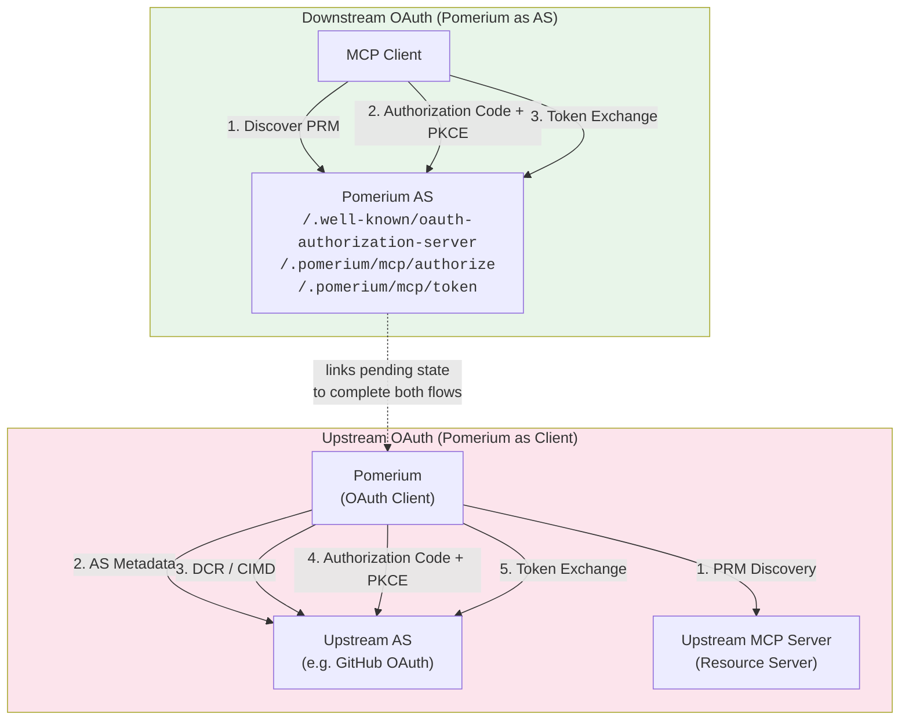
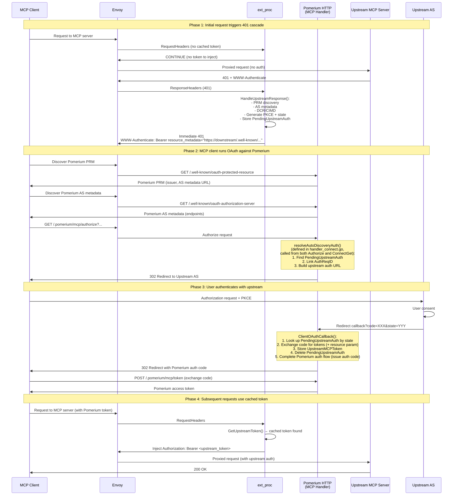
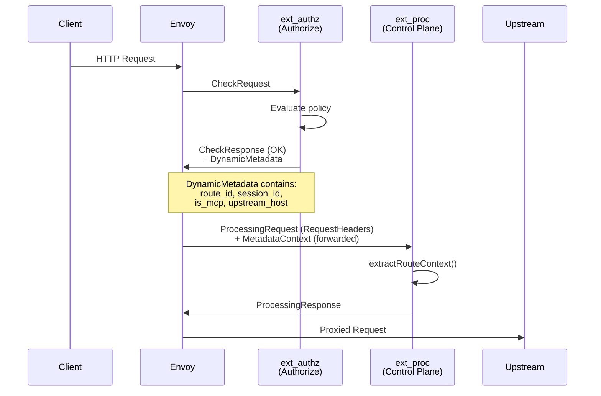
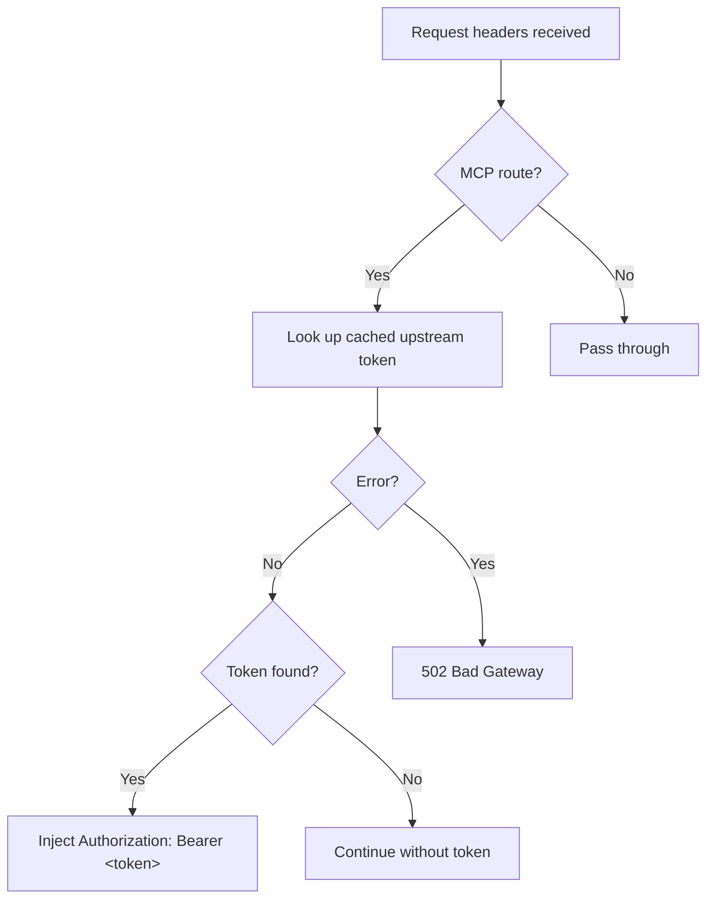
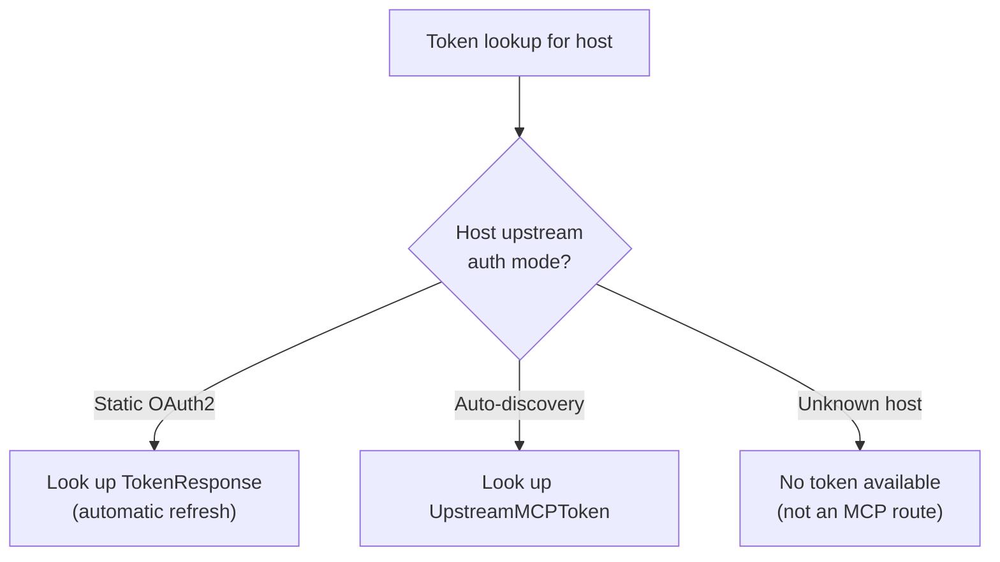
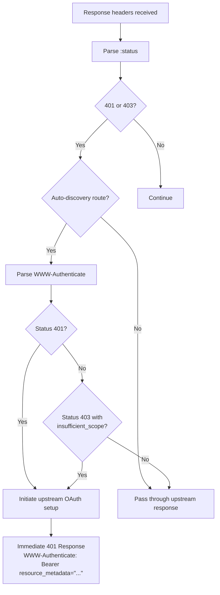
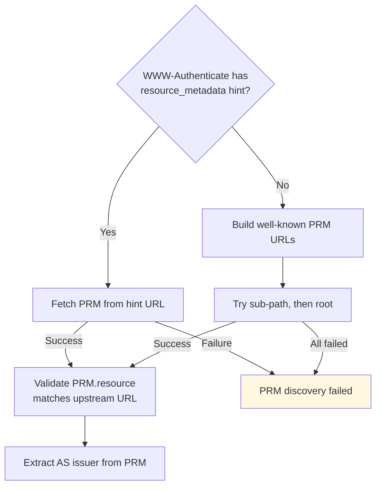
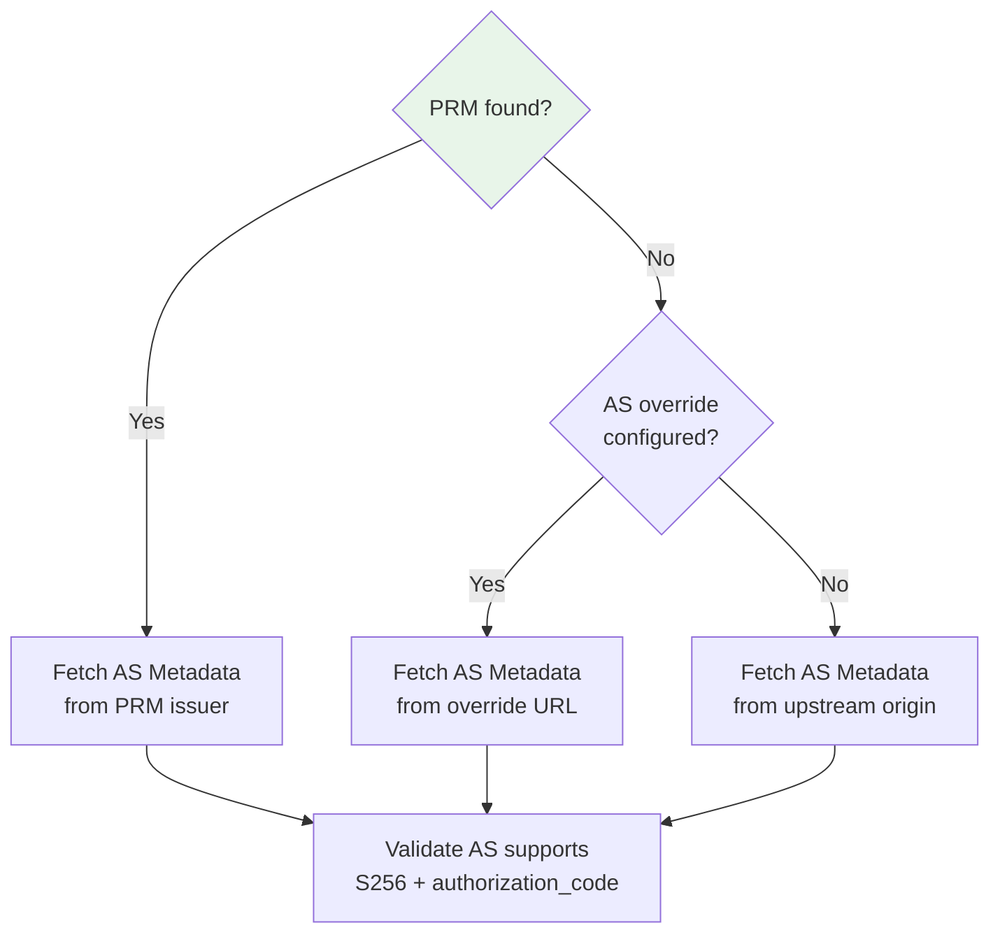
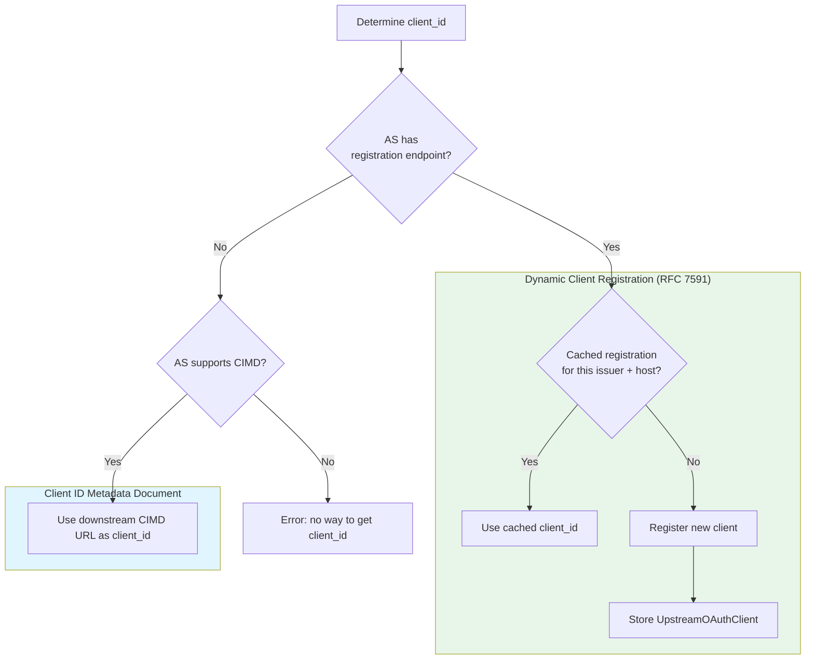
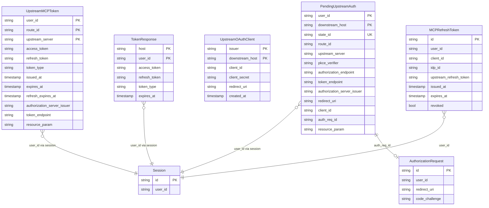

# MCP Proxying Architecture

This document describes how Pomerium proxies MCP (Model Context Protocol) traffic,
injecting upstream OAuth tokens and intercepting auth challenges transparently.

## Table of Contents

- [Overview](#overview)
- [Dual-Role OAuth Architecture](#dual-role-oauth-architecture)
- [The Callback Flow](#the-callback-flow)
- [Downstream Token Refresh Lifecycle](#downstream-token-refresh-lifecycle)
- [Envoy Filter Chain](#envoy-filter-chain)
- [Metadata Pipeline: ext\_authz to ext\_proc](#metadata-pipeline-ext_authz-to-ext_proc)
- [Downstream vs Upstream Host Routing](#downstream-vs-upstream-host-routing)
- [Request Path: Token Injection](#request-path-token-injection)
- [Response Path: 401/403 Interception](#response-path-401403-interception)
- [Upstream OAuth Discovery](#upstream-oauth-discovery)
- [Client Registration (DCR and CIMD)](#client-registration-dcr-and-cimd)
- [Storage Model](#storage-model)
- [Configuration and Wiring](#configuration-and-wiring)
- [Endpoint Map](#endpoint-map)
- [Key Files](#key-files)

---

## Overview

Pomerium acts as an MCP-aware reverse proxy. An MCP client (e.g., Claude Desktop)
connects to Pomerium, which authenticates the client using its own OAuth 2.1
Authorization Server, then proxies requests to an upstream MCP server (e.g.,
GitHub's MCP API, Linear's MCP API). The upstream server may itself require OAuth
tokens that Pomerium must obtain on the user's behalf.

Two Envoy filters work in tandem:

1. **ext_authz** (Authorize service) — Authenticates the user, evaluates
   policy, and passes route metadata downstream.
2. **ext_proc** (Control Plane service) — Intercepts request/response headers
   on MCP routes to inject upstream tokens and handle auth challenges.

See [The Callback Flow](#the-callback-flow) for the full end-to-end request path.

---

## Dual-Role OAuth Architecture

Pomerium participates in two separate OAuth 2.1 flows simultaneously:



**Downstream flow**: The MCP client authenticates with Pomerium's own OAuth AS.
Pomerium serves its own Protected Resource Metadata (PRM), Authorization Server
metadata, and standard OAuth endpoints (`/authorize`, `/token`, `/register`).

**Upstream flow**: Pomerium acts as an OAuth client to the upstream MCP server's
authorization server. This flow is triggered when the upstream returns a 401/403,
intercepted by ext_proc.

The key link between the two flows is the **PendingUpstreamAuth** state. When
ext_proc intercepts a 401 from upstream, it stores pending auth state and returns
a 401 to the MCP client with Pomerium's own PRM URL. The MCP client then
re-runs its auth flow against Pomerium, which links the Pomerium authorization
request to the pending upstream auth state and redirects the user to the upstream
AS for consent.

### Upstream Auth Modes

The upstream flow supports two modes:

| Mode | Config | How It Works |
|---|---|---|
| **Auto-discovery** | No `upstream_oauth2` in policy | Discovers upstream OAuth config dynamically via PRM (RFC 9728), registers as a client via DCR or CIMD, and runs authorization code flow on the user's behalf. This is the standard MCP approach. |
| **Static OAuth2** | `upstream_oauth2` block in policy | Pre-configured OAuth2 client credentials (client ID, secret, endpoints). Uses standard token source with automatic refresh. |

Auto-discovery handles the full MCP spec-compliant flow. Static OAuth2 is a
Pomerium-specific shortcut for upstreams with known, fixed OAuth configurations.

---

## The Callback Flow

The complete end-to-end flow when an MCP client first accesses an upstream
MCP server that requires OAuth. This assumes the request has already passed
ext_authz — the user has a valid Pomerium session and the route policy allows
access.



---

## Downstream Token Refresh Lifecycle

When Pomerium issues tokens to the MCP client (Phase 2-3 above), it also
issues a refresh token. This refresh token is backed by an `MCPRefreshToken`
record that stores the upstream IdP refresh token, enabling Pomerium to
recreate sessions long after the original session expires.

### Token Issuance

During the authorization code exchange (`POST /.pomerium/mcp/token`), Pomerium:
1. Creates an `MCPRefreshToken` record containing the upstream IdP refresh token,
   user ID, client ID, and IdP identifier
2. Encrypts the record ID into an opaque refresh token string (AES-GCM with
   the client ID as AAD, key derived via HKDF from the shared secret)
3. Returns the encrypted string as `refresh_token` in the token response

### Token Refresh

When the MCP client's access token expires, it presents the refresh token
to `POST /.pomerium/mcp/token` with `grant_type=refresh_token`:

1. Pomerium decrypts the refresh token string to recover the record ID
   (decryption fails if the client ID doesn't match — the token is bound
   to the client that received it)
2. Fetches the `MCPRefreshToken` record and validates it (not revoked, not
   expired, client ID matches)
3. Recreates a Pomerium session by refreshing the upstream IdP token using
   the stored `upstream_refresh_token`
4. If the upstream IdP rotated the refresh token, updates the record
5. **Rotates the downstream token**: creates a new `MCPRefreshToken` record,
   marks the old one as revoked, and returns a new encrypted refresh token

### Key Design Points

- **TTL**: 365 days, decoupled from session lifetime (~14 hours). This allows
  MCP clients to maintain long-lived connections.
- **Rotation**: Every successful refresh creates a new record and revokes the
  old one. New record is stored *before* old one is revoked (if revocation
  fails, the user still has a valid token).
- **Encryption**: The refresh token string is encrypted with AES-GCM. The
  client ID is used as Additional Authenticated Data, binding the token to
  the specific MCP client. Key is derived from the Pomerium shared secret
  via HKDF.
- **Session recreation**: `MCPRefreshToken` stores the upstream IdP refresh
  token (not the upstream MCP server token). This allows Pomerium to create
  a fresh session via the IdP even after the original session has expired.

---

## Envoy Filter Chain

ext_authz precedes ext_proc in the HTTP filter chain. ext_authz authenticates
the request and produces DynamicMetadata (session ID, route ID, upstream host).
ext_proc consumes this metadata to inject tokens and intercept auth challenges.

### Per-Route Activation

ext_proc is **globally disabled** (`Disabled: true` in the HttpFilter config).
It only activates on routes where per-route config overrides enable it —
specifically, routes with `policy.IsMCPServer() == true`.

```
config/envoyconfig/routes.go:
  if policy.IsMCPServer() {
      route.TypedPerFilterConfig["envoy.filters.http.ext_proc"] = PerFilterConfigExtProcEnabled()
  }
```

The override sets the processing mode:

| Phase | Mode | Reason |
|---|---|---|
| Request Headers | `SEND` | Inject Authorization header |
| Response Headers | `SEND` | Intercept 401/403 status |
| Bodies / Trailers | `NONE` / `SKIP` | Not inspected |

### Metadata Forwarding

ext_proc receives ext_authz's DynamicMetadata via `MetadataOptions.ForwardingNamespaces`:

```
ForwardingNamespaces.Untyped: ["envoy.filters.http.ext_authz"]
```

This is how route context (session ID, route ID, upstream host) flows from
ext_authz to ext_proc. Without this, ext_proc would have no knowledge of the
authenticated user or the route configuration.

---

## Metadata Pipeline: ext_authz to ext_proc

The metadata pipeline is the critical data handoff between Pomerium's
authorization service and the ext_proc token injection logic.



### Metadata Structure

The metadata is nested under two namespaces:

```
MetadataContext.FilterMetadata
  └── "envoy.filters.http.ext_authz"          (ExtAuthzMetadataNamespace)
        └── "com.pomerium.route-context"       (RouteContextMetadataNamespace)
              ├── "route_id"      string        Envoy route ID
              ├── "session_id"    string        Pomerium session ID
              ├── "is_mcp"        bool          Always true for MCP routes
              └── "upstream_host" string        Actual upstream hostname (e.g. "api.github.com")
```

**Producer** (`authorize/route_context_metadata.go`):
`BuildRouteContextMetadata()` creates this struct when ext_authz approves a
request for an MCP server route. The upstream host comes from
`request.Policy.To[0].URL.Hostname()`.

**Consumer** (`internal/mcp/extproc/server.go`):
`extractRouteContext()` walks the metadata path to build a `RouteContext` struct.

---

## Downstream vs Upstream Host Routing

This is the most subtle aspect of the architecture. Envoy rewrites the
`:authority` header to the upstream host **after** ext_proc processes request
headers, so ext_proc always sees the downstream host in `:authority`.

ext_proc has two hostnames available:

- **`downstreamHost`** — from the `:authority` pseudo-header
  (e.g., `github.localhost.pomerium.io`). This is the Pomerium-facing hostname
  the client connected to.
- **`upstreamHost`** — from `routeCtx.UpstreamHost`, passed via ext_authz
  metadata (e.g., `api.github.com`). This is the actual upstream server.

Each must be used in the right context:

| Host | Use For | Example |
|---|---|---|
| **downstream** | HostInfo lookups, callback URLs, CIMD URLs, PRM URL in 401 responses | `https://github.localhost.pomerium.io/.pomerium/mcp/client/oauth/callback` |
| **upstream** | `originalURL` construction, PRM discovery, token storage keys, OAuth `resource` parameter | `https://api.github.com/.well-known/oauth-protected-resource` |

**Critical rule**: Never pass `upstreamHost` to HostInfo lookups (HostInfo is
keyed by downstream hostnames from `policy.GetFrom()`). Never use
`downstreamHost` for PRM discovery or the OAuth resource parameter (those
must use the actual upstream URL).

---

## Request Path: Token Injection

When ext_proc receives request headers for an MCP route, it attempts to inject
a cached upstream token.



### Token Lookup Dispatch

`GetUpstreamToken` dispatches based on how the host is configured in HostInfo:



**Static OAuth2 path**: Looks up `TokenResponse` by `{host, user_id}`.
Wraps it in Go's `oauth2.Config.TokenSource` which handles refresh automatically.

**Auto-discovery path**: Looks up `UpstreamMCPToken` by
`{user_id, route_id, upstream_server}`. If expired with both a refresh token
and a stored token endpoint, performs inline refresh via singleflight. If
expired without a refresh token (or without a token endpoint), deletes the
stale token and returns empty (the subsequent 401 from upstream will trigger
the full OAuth flow).

---

## Response Path: 401/403 Interception

When upstream returns 401 or 403, ext_proc intercepts the response. For
auto-discovery routes, it evaluates whether to initiate an upstream OAuth
flow. Static routes pass through — the upstream 401 propagates to the client.



When the response is actionable, ext_proc:
1. Resolves route info (upstream server URL, callback URL, client ID URL)
2. Strips the query from the original URL to form the OAuth `resource` parameter
3. Looks up the user ID from the session
4. Runs upstream OAuth discovery and client registration (see
   [Upstream OAuth Discovery](#upstream-oauth-discovery) and
   [Client Registration](#client-registration-dcr-and-cimd))
5. Generates PKCE challenge and state
6. Stores a `PendingUpstreamAuth` record
7. Returns a 401 with Pomerium's PRM URL as `resource_metadata`

---

## Upstream OAuth Discovery

When the upstream returns a 401, Pomerium must discover the upstream's OAuth
configuration. This follows the MCP authorization spec (Protocol Revision 2025-11-25)
and RFC 9728 (Protected Resource Metadata).

**Inputs to discovery:**
- **WWW-Authenticate header** — may contain a `resource_metadata` hint URL
- **Upstream server URL** — the actual upstream host (e.g., `https://api.github.com`)
- **AS override** (optional) — a pre-configured authorization server URL from route policy

### Step 1: Protected Resource Metadata (PRM)



The well-known PRM URLs follow RFC 9728:
1. `{origin}/.well-known/oauth-protected-resource/{path}` (sub-path)
2. `{origin}/.well-known/oauth-protected-resource` (root)

### Step 2: Authorization Server Metadata

If PRM succeeds, the issuer from `authorization_servers[0]` is used to fetch
AS metadata. If PRM fails, a fallback is used.



AS metadata is fetched per RFC 8414, trying in order:
1. `{issuer}/.well-known/oauth-authorization-server[/{path}]`
2. `{issuer}/.well-known/openid-configuration[/{path}]`
3. `{issuer}[/{path}]/.well-known/openid-configuration`

Validation ensures the AS supports `S256` code challenges and
`authorization_code` grants (if `grant_types_supported` is present; omission
implies support per RFC 8414 §2).

---

## Client Registration (DCR and CIMD)

After discovering the upstream AS metadata, Pomerium needs a `client_id` to use
in the authorization request. Two mechanisms are supported:



DCR sends a `POST /register` with `{client_name, redirect_uris, grant_types,
response_types, token_endpoint_auth_method: "none"}`. CIMD uses the URL
`https://{downstream_host}/.pomerium/mcp/client/metadata.json` as the client_id.

DCR is preferred in practice because most existing MCP servers support it.
Note that DCR has been removed from the MCP spec itself — its use here is
purely for historic/convenience reasons. CIMD is the spec-compliant
mechanism going forward, but the Pomerium proxy's CIMD URL (on the downstream
domain) may not be reachable from the upstream AS (e.g., local dev domains),
which further motivates keeping DCR support.

DCR registrations are cached per `{issuer, downstream_host}` and shared across
all users.

---

## Storage Model

All MCP-related state is stored in the **databroker**.

### Databroker Record Types

The MCP package introduces the following databroker record types:

**Upstream auth (ext_proc / token injection):**

| Proto Type | Short Name | Key | Purpose |
|---|---|---|---|
| `oauth21.UpstreamMCPToken` | UpstreamMCPToken | `{user_id, route_id, upstream_server}` | Cached upstream tokens for auto-discovery routes. Includes access/refresh tokens, AS endpoints, and resource indicator. |
| `oauth21.PendingUpstreamAuth` | PendingUpstreamAuth | `{user_id, downstream_host}` + `state_id` index | In-flight upstream OAuth state. Created on 401 interception, consumed by callback. TTL: 5 min. |
| `oauth21.UpstreamOAuthClient` | UpstreamOAuthClient | `{type="dcr", issuer, downstream_host}` | Cached DCR registrations. Shared across all users for a given AS+host pair. |
| `oauth21.TokenResponse` | TokenResponse | `{host, user_id}` | Upstream tokens for static `upstream_oauth2` routes. |

**Downstream auth (Pomerium as OAuth AS):**

| Proto Type | Short Name | Key | Purpose |
|---|---|---|---|
| `oauth21.AuthorizationRequest` | AuthorizationRequest | request ID | Downstream OAuth authorization code flow state. Links to PendingUpstreamAuth for auto-discovery routes. |
| `oauth21.MCPRefreshToken` | MCPRefreshToken | token ID (UUID) | Downstream refresh token issued to MCP clients. Stores upstream IdP refresh token for session recreation. TTL: 365 days. Rotated on each use. |
| `ietf.rfc7591.v1.ClientRegistration` | ClientRegistration | client ID | RFC 7591 downstream client registration. Stores metadata for MCP clients registered with Pomerium's AS. |

### Record Relationships



**Key design decisions**:
- `PendingUpstreamAuth` uses `{user_id, downstream_host}` as its primary key,
  so at most one pending auth exists per user per downstream host. A new auth
  flow overwrites the previous one.
- `state_id` is separately indexed for lookup during the callback
  (`GetPendingUpstreamAuthByState` uses databroker Query with filter).
- `UpstreamOAuthClient` (DCR) is per-instance, not per-user: one registration
  is shared across all users for a given AS+host pair.
- Singleflight keys include `userID` to prevent cross-user token leaks during
  concurrent refresh.

---

## Configuration and Wiring

### Runtime Flag

The `RuntimeFlagMCP` (`config/runtime_flags.go`) gates MCP functionality.
When enabled:
1. The controlplane auto-creates an `UpstreamRequestHandler`
2. MCP well-known routes are added to virtual hosts

### Controlplane Wiring

At startup (`controlplane.NewServer()`):
1. If `RuntimeFlagMCP` is set, create an `UpstreamRequestHandler` (with
   databroker storage, HostInfo from config, and an HTTP client). If handler
   creation fails, log a warning and continue with `handler = nil`.
2. Create the ext_proc gRPC server (with the handler, which may be nil).
3. Register ext_proc on the gRPC server.

During Envoy config generation:
1. The ext_proc filter is added globally but **disabled by default**.
2. MCP server routes get a per-route override enabling ext_proc.
3. MCP well-known routes (PRM, AS metadata, etc.) are added to virtual hosts.

### HostInfo Resolution

`HostInfo` indexes all MCP policies by downstream hostname at startup (lazy,
via `sync.Once`). It provides the dispatch mechanism for token lookup.

Each policy produces a `ServerHostInfo` keyed by the downstream hostname
(from `policy.GetFrom()`), containing the upstream URL, an optional AS
override, and the `upstream_oauth2` config (if any). For example, a policy
with `From: github.localhost.pomerium.io` and `To: api.github.com` produces
a map entry keyed by `github.localhost.pomerium.io`.

The upstream auth mode is determined by whether the policy has an
`upstream_oauth2` config: if present, static OAuth2 mode; if absent,
auto-discovery mode. Both `UsesAutoDiscovery()` and
`GetOAuth2ConfigForHost()` return false/nil for hosts not in the map
(i.e., hosts without MCP policy).

---

## Endpoint Map

All MCP-related HTTP endpoints served by Pomerium:

| Endpoint | Method | Handler | Purpose |
|---|---|---|---|
| `/.well-known/oauth-protected-resource` | GET | `ProtectedResourceMetadata` | Pomerium's PRM document |
| `/.well-known/oauth-authorization-server` | GET | `AuthorizationServerMetadata` | Pomerium's AS metadata |
| `/.pomerium/mcp/register` | POST | `RegisterClient` | RFC 7591 Dynamic Client Registration |
| `/.pomerium/mcp/authorize` | GET | `Authorize` | OAuth 2.1 authorization endpoint |
| `/.pomerium/mcp/token` | POST | `Token` | OAuth 2.1 token endpoint |
| `/.pomerium/mcp/server/oauth/callback` | GET | `OAuthCallback` | Callback for static `upstream_oauth2` flow |
| `/.pomerium/mcp/client/oauth/callback` | GET | `ClientOAuthCallback` | Callback for upstream auto-discovery flow |
| `/.pomerium/mcp/client/metadata.json` | GET | `ClientIDMetadata` | CIMD document for upstream AS |
| `/.pomerium/mcp/routes` | GET | `ListRoutes` | List MCP server routes for a user |
| `/.pomerium/mcp/connect` | GET | `ConnectGet` | Proactive upstream token acquisition |
| `/.pomerium/mcp/routes/disconnect` | POST | `DisconnectRoutes` | Purge upstream tokens |

---

## Key Files

| File | Purpose |
|---|---|
| `internal/mcp/extproc/server.go` | ext_proc gRPC server: `Process()` loop, `extractRouteContext()`, `handleRequestHeaders()`, `handleResponseHeaders()` |
| `internal/mcp/extproc/handler.go` | `UpstreamRequestHandler` interface, `UpstreamAuthAction`, response builders |
| `internal/mcp/upstream_auth.go` | Concrete `UpstreamRequestHandler`: token lookup, 401 handling, `runDiscovery()`, `runUpstreamOAuthSetup()`, DCR, PKCE, refresh |
| `internal/mcp/upstream_discovery.go` | PRM fetch, AS metadata fetch, well-known URL builders, validators (helpers called by `runDiscovery`) |
| `internal/mcp/handler.go` | MCP HTTP handler: endpoint registration, `Handler` struct |
| `internal/mcp/handler_authorization.go` | `/authorize` endpoint: links pending upstream auth to Pomerium auth requests |
| `internal/mcp/handler_client_oauth_callback.go` | Upstream OAuth callback: code exchange, token storage, flow completion |
| `internal/mcp/handler_connect.go` | `/connect` endpoint: proactive upstream token acquisition, `resolveAutoDiscoveryAuth()` |
| `internal/mcp/handler_metadata.go` | Metadata types: `AuthorizationServerMetadata`, `ProtectedResourceMetadata` |
| `internal/mcp/host_info.go` | `HostInfo`: downstream hostname → route config resolution |
| `internal/mcp/storage.go` | `handlerStorage` interface and databroker implementation |
| `internal/mcp/www_authenticate.go` | `ParseWWWAuthenticate`: SFV-based Bearer challenge parsing |
| `authorize/route_context_metadata.go` | `BuildRouteContextMetadata`: produces ext_authz → ext_proc metadata |
| `config/envoyconfig/filters.go` | `ExtProcFilter()`, `ExtAuthzFilter()` definitions |
| `config/envoyconfig/routes.go` | Per-route ext_proc enablement for MCP routes |
| `config/envoyconfig/per_filter_config.go` | `PerFilterConfigExtProcEnabled()` processing mode |
| `internal/controlplane/server.go` | Controlplane wiring: auto-creates handler, registers ext_proc gRPC |
