# MCP Proxying Architecture

This document describes how Pomerium proxies MCP (Model Context Protocol) traffic,
injecting upstream OAuth tokens and intercepting auth challenges transparently.

## Table of Contents

- [Overview](#overview)
- [Dual-Role OAuth Architecture](#dual-role-oauth-architecture)
- [Envoy Filter Chain](#envoy-filter-chain)
- [Metadata Pipeline: ext\_authz to ext\_proc](#metadata-pipeline-ext_authz-to-ext_proc)
- [Request Path: Token Injection](#request-path-token-injection)
- [Response Path: 401/403 Interception](#response-path-401403-interception)
- [Upstream OAuth Discovery](#upstream-oauth-discovery)
- [Client Registration (DCR and CIMD)](#client-registration-dcr-and-cimd)
- [The Callback Flow](#the-callback-flow)
- [Downstream vs Upstream Host Routing](#downstream-vs-upstream-host-routing)
- [Storage Model](#storage-model)
- [Configuration and Wiring](#configuration-and-wiring)
- [Endpoint Map](#endpoint-map)
- [Key Files](#key-files)

---

## Overview

Pomerium acts as an MCP-aware reverse proxy. An MCP client (e.g., Claude Desktop)
connects to Pomerium, which authenticates the client using its own OAuth 2.1
Authorization Server, then proxies requests to an upstream MCP server (e.g.,
GitHub's MCP API, Linear's MCP API). The upstream server may itself require OAuth
tokens that Pomerium must obtain on the user's behalf.

Two Envoy filters work in tandem to make this work:

1. **ext_authz** — Pomerium's existing authorization filter. Authenticates the
   user, evaluates policy, and passes route metadata downstream.
2. **ext_proc** — A new external processor filter. Intercepts request/response
   headers on MCP routes to inject upstream tokens and handle auth challenges.

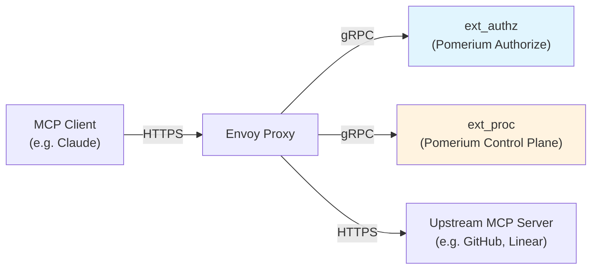

---

## Dual-Role OAuth Architecture

Pomerium participates in two separate OAuth 2.1 flows simultaneously:

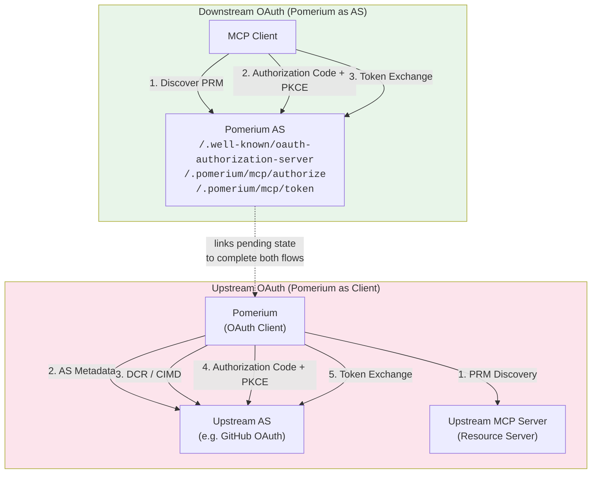

**Downstream flow**: The MCP client authenticates with Pomerium's own OAuth AS.
Pomerium serves its own Protected Resource Metadata (PRM), Authorization Server
metadata, and standard OAuth endpoints (`/authorize`, `/token`, `/register`).

**Upstream flow**: Pomerium acts as an OAuth client to the upstream MCP server's
authorization server. This flow is triggered when the upstream returns a 401/403,
intercepted by ext_proc.

The key link between the two flows is the **PendingUpstreamAuth** state. When
ext_proc intercepts a 401 from upstream, it stores pending auth state and returns
a 401 to the MCP client with Pomerium's own PRM URL. The MCP client then
re-runs its auth flow against Pomerium, which links the Pomerium authorization
request to the pending upstream auth state and redirects the user to the upstream
AS for consent.

---

## Envoy Filter Chain

The main HTTP connection manager filter chain is ordered as follows:

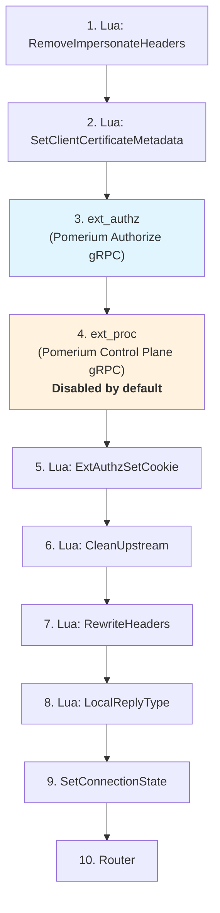

**ext_proc is globally disabled** (`Disabled: true` in the HttpFilter config).
It only activates on routes where per-route config overrides enable it —
specifically, routes with `policy.IsMCPServer() == true`.

Both ext_authz and ext_proc connect to Pomerium's gRPC server(s):
- ext_authz → `pomerium-authorize` cluster (the Authorize service)
- ext_proc → `pomerium-control-plane-grpc` cluster (the Control Plane service)

### Per-Route Activation

When building Envoy route config, MCP server routes get a per-route override
that enables ext_proc:

```
config/envoyconfig/routes.go:
  if policy.IsMCPServer() {
      route.TypedPerFilterConfig["envoy.filters.http.ext_proc"] = PerFilterConfigExtProcEnabled()
  }
```

The override sets processing mode to `SEND` for request and response headers,
and `NONE`/`SKIP` for bodies and trailers:

| Phase | Mode | Reason |
|---|---|---|
| Request Headers | `SEND` | Inject Authorization header |
| Request Body | `NONE` | No body inspection needed |
| Response Headers | `SEND` | Intercept 401/403 status |
| Response Body | `NONE` | No body inspection needed |
| Trailers | `SKIP` | Not relevant |

### Metadata Forwarding

The ext_proc filter is configured with `MetadataOptions.ForwardingNamespaces`
to receive ext_authz's DynamicMetadata:

```
ForwardingNamespaces.Untyped: ["envoy.filters.http.ext_authz"]
```

This is how route context (session ID, route ID, upstream host) flows from
ext_authz to ext_proc. Without this, ext_proc would have no knowledge of the
authenticated user or the route configuration.

---

## Metadata Pipeline: ext_authz to ext_proc

The metadata pipeline is the critical data handoff between Pomerium's
authorization service and the ext_proc token injection logic.

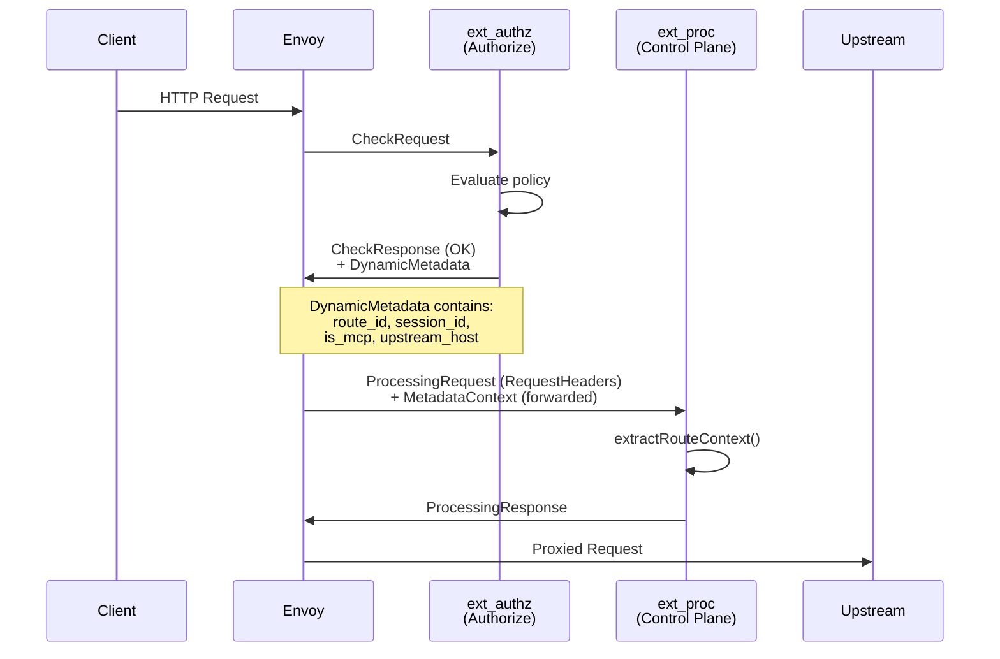

### Metadata Structure

The metadata is nested under two namespaces:

```
MetadataContext.FilterMetadata
  └── "envoy.filters.http.ext_authz"          (ExtAuthzMetadataNamespace)
        └── "com.pomerium.route-context"       (RouteContextMetadataNamespace)
              ├── "route_id"      string        Envoy route ID
              ├── "session_id"    string        Pomerium session ID
              ├── "is_mcp"        bool          Always true for MCP routes
              └── "upstream_host" string        Actual upstream hostname (e.g. "api.github.com")
```

**Producer** (`authorize/route_context_metadata.go`):
`BuildRouteContextMetadata()` creates this struct when ext_authz approves a
request for an MCP server route. The upstream host comes from
`request.Policy.To[0].URL.Hostname()`.

**Consumer** (`internal/mcp/extproc/server.go`):
`extractRouteContext()` walks the metadata path to build a `RouteContext` struct.

---

## Request Path: Token Injection

When ext_proc receives request headers for an MCP route, it attempts to inject
a cached upstream token.

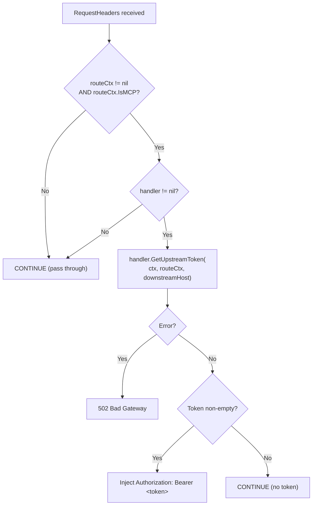

### Token Lookup Dispatch

`GetUpstreamToken` dispatches based on route configuration:

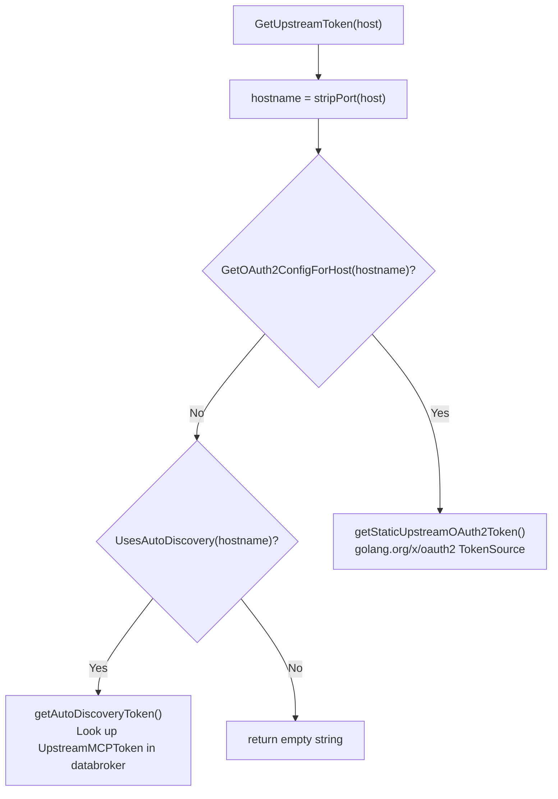

**Static path** (`upstream_oauth2` config): Uses the standard Go `oauth2.Config.TokenSource`
which handles refresh automatically. Tokens are stored per `{host, user_id}`.

**Auto-discovery path** (no `upstream_oauth2` config): Looks up `UpstreamMCPToken`
by `{user_id, route_id, upstream_server}`. If expired with both a refresh token
and a stored token endpoint, performs inline refresh via singleflight. If
expired without a refresh token (or without a token endpoint), deletes the
stale token and returns empty (the subsequent 401 from upstream will trigger
the full OAuth flow).

---

## Response Path: 401/403 Interception

When upstream returns 401 or 403, ext_proc delegates to the handler which
may initiate the upstream OAuth flow.

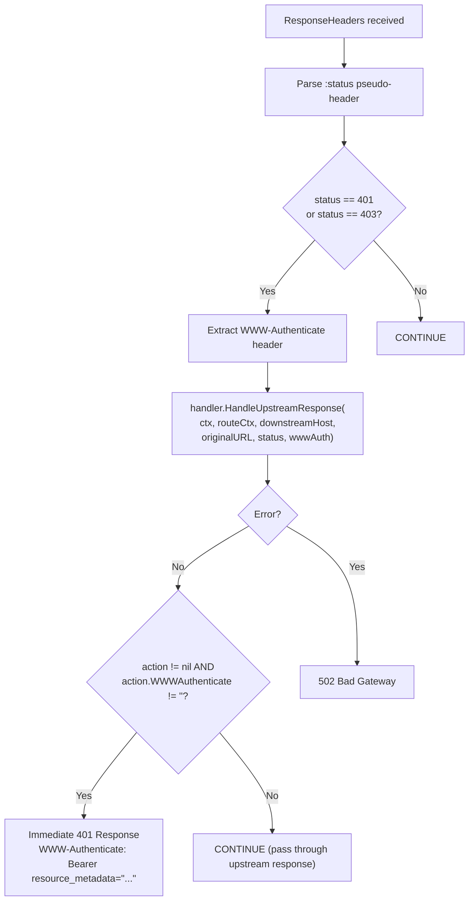

### HandleUpstreamResponse Decision Tree

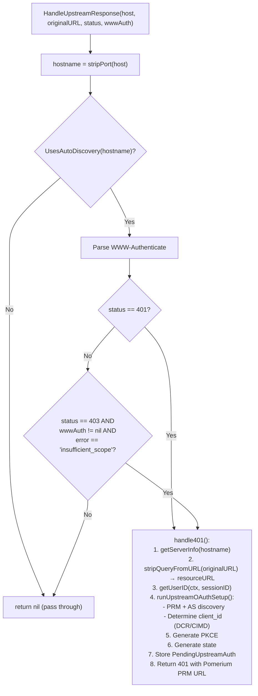

---

## Upstream OAuth Discovery

When the upstream returns a 401, Pomerium must discover the upstream's OAuth
configuration. This follows the MCP authorization spec (Protocol Revision 2025-11-25)
and RFC 9728 (Protected Resource Metadata).

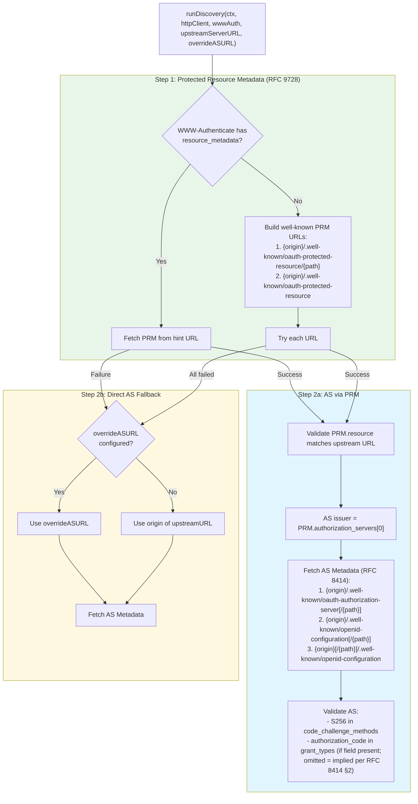

---

## Client Registration (DCR and CIMD)

After discovering the upstream AS metadata, Pomerium needs a `client_id` to use
in the authorization request. Two mechanisms are supported:

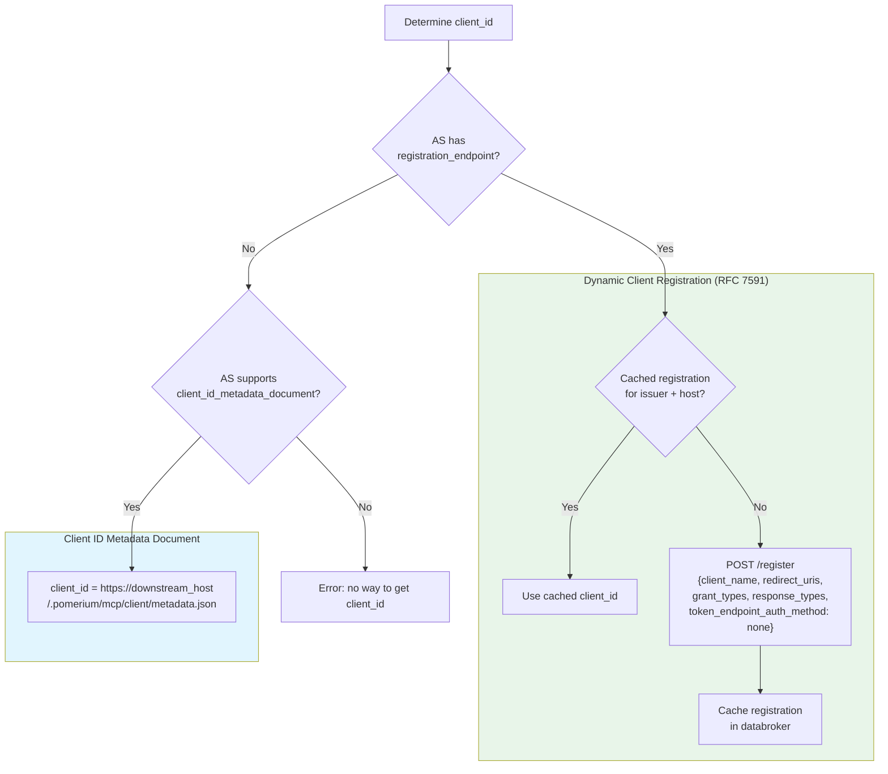

DCR is preferred because the Pomerium proxy's CIMD URL (on the downstream
domain) may not be reachable from the upstream AS (e.g., local dev domains).
DCR registrations are cached per `{issuer, downstream_host}` and shared across
all users.

---

## The Callback Flow

The complete end-to-end flow when an MCP client first accesses an upstream
MCP server that requires OAuth:

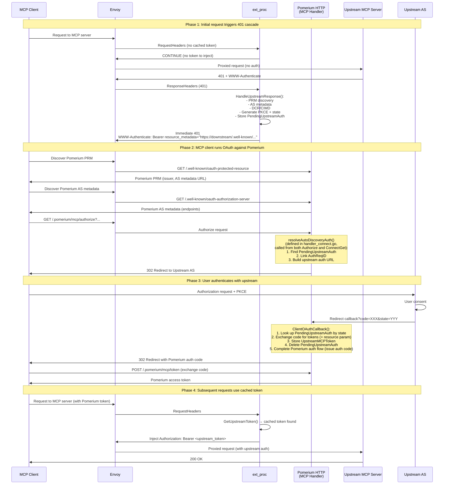

---

## Downstream vs Upstream Host Routing

This is the most subtle aspect of the architecture. Envoy rewrites the
`:authority` header to the upstream host **after** ext_proc processes request
headers, so ext_proc sees the downstream host in `:authority`.

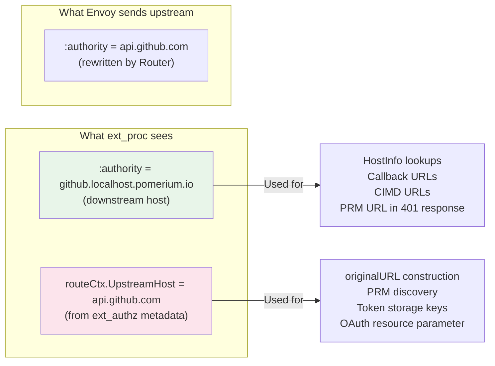

| Value | Source | Used For |
|---|---|---|
| `downstreamHost` | `:authority` pseudo-header | HostInfo lookups, callback/CIMD URL construction, PRM URL in 401 responses |
| `upstreamHost` | `routeCtx.UpstreamHost` from ext_authz metadata | `originalURL` construction, PRM discovery, token storage keys, OAuth `resource` parameter |

**Critical rule**: Never pass `upstreamHost` to HostInfo lookups (HostInfo is
keyed by downstream hostnames from `policy.GetFrom()`). Never use
`downstreamHost` for PRM discovery or the OAuth resource parameter (those
must use the actual upstream URL).

---

## Storage Model

All MCP-related state is stored in the **databroker**, Pomerium's distributed
key-value store. Records are protobuf messages serialized into `anypb.Any`.

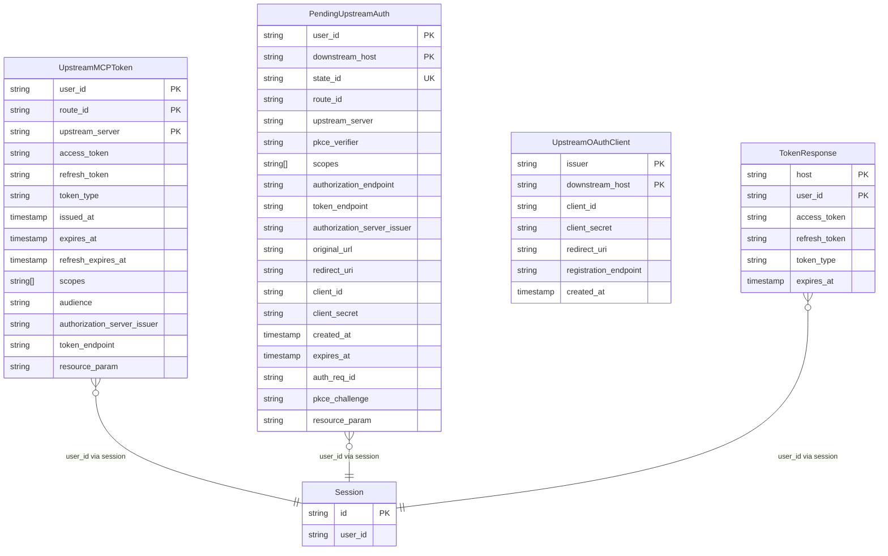

| Type | Composite Key | Purpose | Lifetime |
|---|---|---|---|
| `UpstreamMCPToken` | `{user_id, route_id, upstream_server}` | Cached upstream tokens (auto-discovery) | Until expiry or disconnect |
| `PendingUpstreamAuth` | `{user_id, downstream_host}` + `state_id` index | In-flight OAuth state | 5 minutes |
| `UpstreamOAuthClient` | `{type="dcr", issuer, downstream_host}` | Cached DCR registrations | Indefinite |
| `TokenResponse` | `{host, user_id}` | Upstream tokens (static `upstream_oauth2`) | Until expiry or disconnect |

**Key design decisions**:
- `PendingUpstreamAuth` uses `{user_id, downstream_host}` as its primary key,
  so at most one pending auth exists per user per downstream host. A new auth
  flow overwrites the previous one.
- `state_id` is separately indexed for O(1) lookup during the callback
  (`GetPendingUpstreamAuthByState` uses databroker Query with filter).
- `UpstreamOAuthClient` (DCR) is per-instance, not per-user: one registration
  is shared across all users for a given AS+host pair.
- Singleflight keys include `userID` to prevent cross-user token leaks during
  concurrent refresh.

---

## Configuration and Wiring

### Runtime Flag

The `RuntimeFlagMCP` (`config/runtime_flags.go`) gates MCP functionality.
When enabled:
1. The controlplane auto-creates an `UpstreamRequestHandler`
2. MCP well-known routes are added to virtual hosts

### Controlplane Wiring

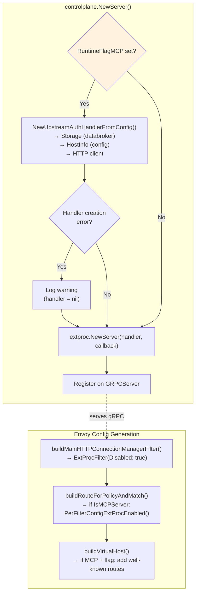

### HostInfo Resolution

`HostInfo` indexes all MCP policies by downstream hostname at startup (lazy,
via `sync.Once`). It provides the dispatch mechanism for token lookup:

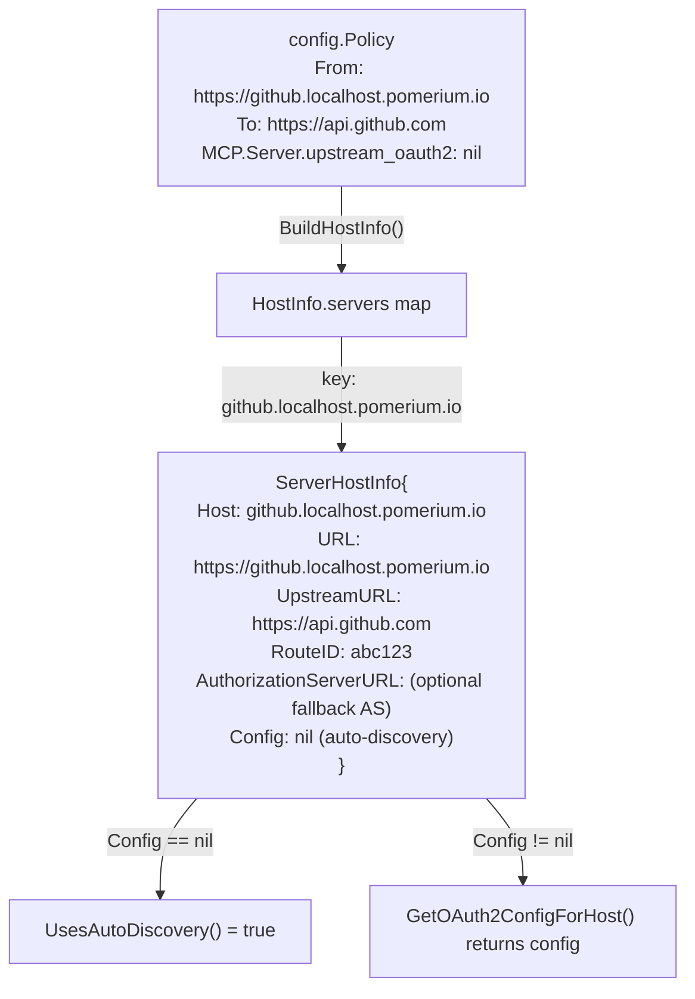

Note: Both `UsesAutoDiscovery()` and `GetOAuth2ConfigForHost()` return false/nil
for hosts not present in the servers map (i.e., hosts without MCP policy).

---

## Endpoint Map

All MCP-related HTTP endpoints served by Pomerium:

| Endpoint | Method | Handler | Purpose |
|---|---|---|---|
| `/.well-known/oauth-protected-resource` | GET | `ProtectedResourceMetadata` | Pomerium's PRM document |
| `/.well-known/oauth-authorization-server` | GET | `AuthorizationServerMetadata` | Pomerium's AS metadata |
| `/.pomerium/mcp/register` | POST | `RegisterClient` | RFC 7591 Dynamic Client Registration |
| `/.pomerium/mcp/authorize` | GET | `Authorize` | OAuth 2.1 authorization endpoint |
| `/.pomerium/mcp/token` | POST | `Token` | OAuth 2.1 token endpoint |
| `/.pomerium/mcp/server/oauth/callback` | GET | `OAuthCallback` | Callback for static `upstream_oauth2` flow |
| `/.pomerium/mcp/client/oauth/callback` | GET | `ClientOAuthCallback` | Callback for upstream auto-discovery flow |
| `/.pomerium/mcp/client/metadata.json` | GET | `ClientIDMetadata` | CIMD document for upstream AS |
| `/.pomerium/mcp/routes` | GET | `ListRoutes` | List MCP server routes for a user |
| `/.pomerium/mcp/connect` | GET | `ConnectGet` | Proactive upstream token acquisition |
| `/.pomerium/mcp/routes/disconnect` | POST | `DisconnectRoutes` | Purge upstream tokens |

---

## Key Files

| File | Purpose |
|---|---|
| `internal/mcp/extproc/server.go` | ext_proc gRPC server: `Process()` loop, `extractRouteContext()`, `handleRequestHeaders()`, `handleResponseHeaders()` |
| `internal/mcp/extproc/handler.go` | `UpstreamRequestHandler` interface, `UpstreamAuthAction`, response builders |
| `internal/mcp/upstream_auth.go` | Concrete `UpstreamRequestHandler`: token lookup, 401 handling, `runDiscovery()`, `runUpstreamOAuthSetup()`, DCR, PKCE, refresh |
| `internal/mcp/upstream_discovery.go` | PRM fetch, AS metadata fetch, well-known URL builders, validators (helpers called by `runDiscovery`) |
| `internal/mcp/handler.go` | MCP HTTP handler: endpoint registration, `Handler` struct |
| `internal/mcp/handler_authorization.go` | `/authorize` endpoint: links pending upstream auth to Pomerium auth requests |
| `internal/mcp/handler_client_oauth_callback.go` | Upstream OAuth callback: code exchange, token storage, flow completion |
| `internal/mcp/handler_connect.go` | `/connect` endpoint: proactive upstream token acquisition, `resolveAutoDiscoveryAuth()` |
| `internal/mcp/handler_metadata.go` | Metadata types: `AuthorizationServerMetadata`, `ProtectedResourceMetadata` |
| `internal/mcp/host_info.go` | `HostInfo`: downstream hostname → route config resolution |
| `internal/mcp/storage.go` | `handlerStorage` interface and databroker implementation |
| `internal/mcp/www_authenticate.go` | `ParseWWWAuthenticate`: SFV-based Bearer challenge parsing |
| `authorize/route_context_metadata.go` | `BuildRouteContextMetadata`: produces ext_authz → ext_proc metadata |
| `config/envoyconfig/filters.go` | `ExtProcFilter()`, `ExtAuthzFilter()` definitions |
| `config/envoyconfig/routes.go` | Per-route ext_proc enablement for MCP routes |
| `config/envoyconfig/per_filter_config.go` | `PerFilterConfigExtProcEnabled()` processing mode |
| `internal/controlplane/server.go` | Controlplane wiring: auto-creates handler, registers ext_proc gRPC |
