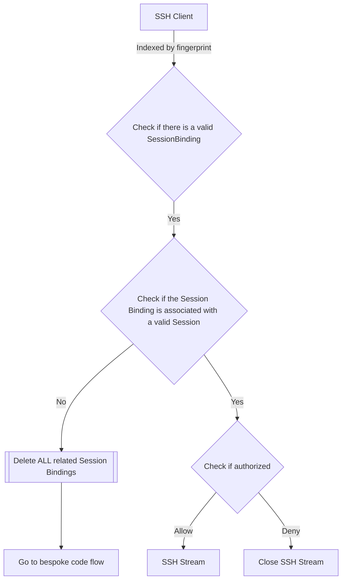
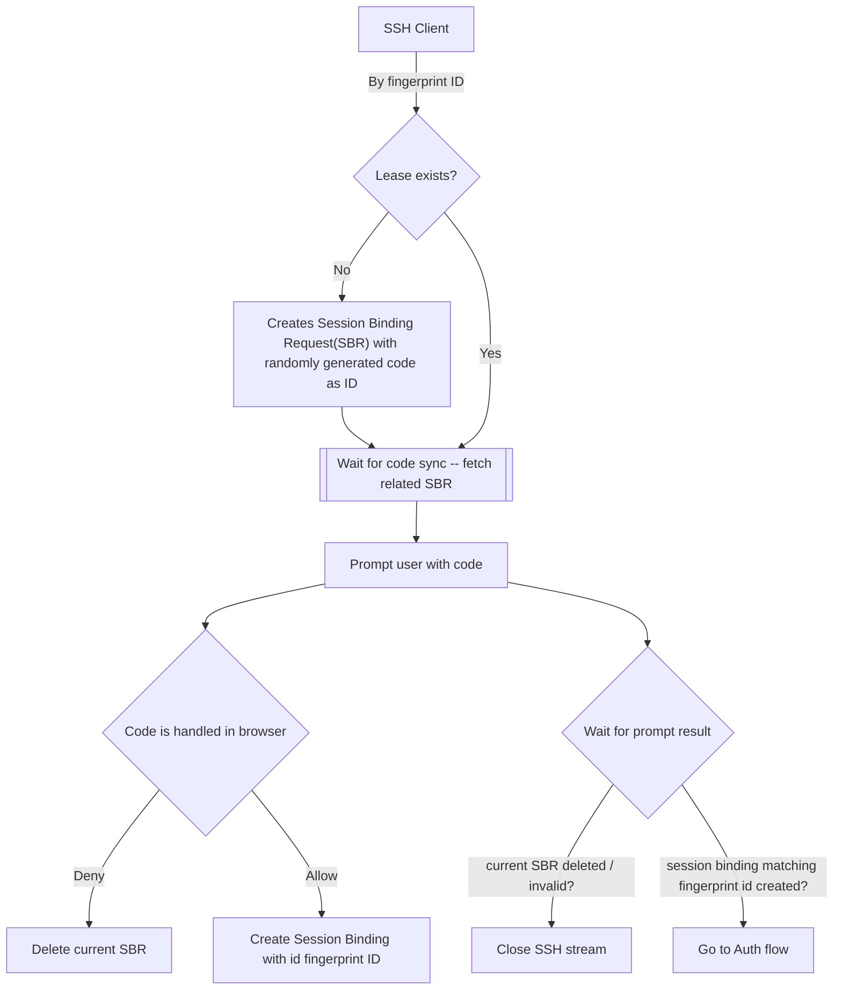
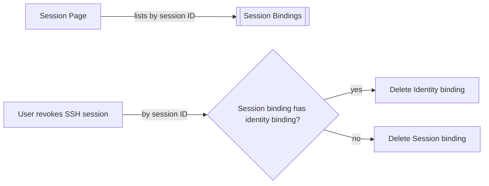
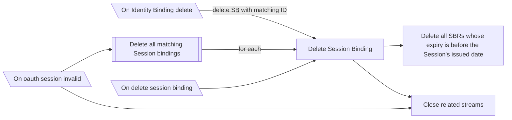

## Lifecycle visualized

New databroker records:

- Session Binding Request
    - Key : temporary code
    - Value : ssh client fingerprintID,  metadata about incoming connection
- Session Binding:
    - Key : ssh client fingerprint ID
    - Value : expiry, "parent" oauth session ID, user metadata, other metedata
- Identity Binding:
    - Key: ssh client fingerprint ID
    - Value : idp, user metadata, other metadata

one-to-many relationships:
- fingerprintID --> code (SBRs)
- session ID --> session binding ID

## Auth flow

## Bespoke Code Flow

## Revoke session flow

## Background tasks

